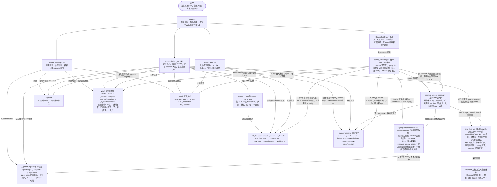

# Hermes + Obsidian 受控知识流程图

> 本文档已按 2026-09-01 获取的远程 `main` 与 `intranet` 当前流程复核。Mermaid 图可在 Obsidian 阅读视图中直接渲染，在编辑视图中修改节点和连线。具体命令契约以当前分支的 `SKILL.md` 和直接 reference 为准。

## 两个分支实际使用的环境

| 项目 | `main` | `intranet` |
| --- | --- | --- |
| Vault 位置 | 使用用户指定或当前任务中的 Vault；当前部署从 WSL 通过 `/mnt/c/...` 访问 Windows 工作区 | 固定使用 `config/intranet.json` 中的 `/opt/data/phq/testVault`，不根据 prompt 临时切换 Vault |
| Skill 位置 | 优先使用 Hermes loader 返回的实际 Skill 目录，不假定固定安装路径 | 仍优先使用 loader 返回的目录；配置的后备检查位置是 `/opt/data/skills/<skill-name>/` |
| PDF 转换 | 通常在 WSL 调用 `/usr/local/bin/mineru`，实际执行 `/root/.venvs/mineru/bin/mineru` | 默认调用 MinerU HTTP API `http://10.27.17.35:7861`；只有明确传入 `--mineru-invocation cli` 时才改用本地 CLI |
| 粗召回检索 | 通过 `/usr/local/bin/qmd-like-rag` 调用独立虚拟环境 `/root/.venvs/qmd-like-rag`；Query 仓库配置当前 `enabled: true` | 使用同一 `hermes-coarse-recall/v1` 协议；Query 仓库配置当前 `enabled: false`，部署时必须明确选择本地命令或 HTTP 服务，不能猜测服务地址 |
| QMD | 只作为明确要求时的对比实验，不是默认 Provider | 不部署 QMD |
| 检索索引存放 | Provider 状态根目录为 `/root/.local/state/qmd-like-rag`，按 Vault 隔离；Chroma、BM25、模型和缓存不放入 Windows Vault | 示例配置使用 Vault 外的 `/opt/data/phq/qmd-like-rag-state`，不放入 `/opt/data/phq/testVault` |
| Provider 模型和设备 | `BAAI/bge-m3` + `BAAI/bge-reranker-large` 固定到不可变 revision，`local_files_only: true`，当前主机使用 CUDA | 使用相同模型 revision；示例从 `/opt/models/...` 本地读取并使用 CPU，实际部署可按主机能力调整，但不能使用未审计模型 |
| 用户查看原文位置 | 答案给出原 PDF 文件名、Vault 相对路径、页码、相关段落和图表位置 | 除相同的原 PDF 证据外，对答案实际使用的命中去重列出 locator 返回的 `原文定位` viewer 链接；没有合格链接时明确说明不可用 |
| 领域短语触发配置 | 从 Query Skill 的 `config/domain-routing.json` 读取 | 从 Query Skill 的 `config/intranet.json` 读取；同一文件还保存固定 Vault 和 viewer 地址 |
| Vault 中是否放 Skill 副本 | Bootstrap 保留可选的 `--copy-skill-note` 用法 | 运行时 Skill 始终位于 `/opt/data/skills/<skill-name>/`，不把 Skill 或安装路径复制进 Vault |

`qmd-like-rag` 是独立安装的检索 Provider，不是第五个 Skill。Query adapter（Query 是否可以只读调用粗召回的开关）和 ingest adapter（Ingest 是否可以维护索引的开关）彼此独立。Vault 内只保存可审计的检索配置和索引状态；可重建的向量、BM25 索引和模型文件保存在 Provider 主机上。

## 从建库、摄取到查询的完整流程

```mermaid
flowchart TB
    START(["用户提供材料或提出问题"])
    TASK{"本次要新建 Vault、摄取材料、检查 Vault，还是查询已有知识？"}

    subgraph ENV["选择当前 Git 分支对应的运行环境"]
        direction TB
        E0{"当前分支"}
        EM["main<br/>使用任务中指定的 Vault<br/>WSL 访问 /mnt/c/..."]
        EI["intranet<br/>固定 Vault: /opt/data/phq/testVault<br/>后备 Skill 根目录: /opt/data/skills"]
        E0 --> EM
        E0 --> EI
    end

    subgraph BOOT["阶段一｜初始化一个可受控摄取的 Obsidian Vault"]
        direction TB
        B0{"目标 Vault 是否已有标准目录和治理文件？"}
        B1["选择 profile（建库时使用的一组目录、规则和模板预设）<br/>general（通用知识库）或 meeting（会议纪要和行动项）"]
        B2["创建 10_Raw、30_Cards、40_Concepts、50_Projects、90_Dataview 和 _system"]
        B3["写入 AGENTS.md（规定 Agent 能读写什么）和 hermes-ingest-rules.md（摄取步骤）<br/>concept registry（已批准概念清单）、文档模板、Dataview 索引和 setup report"]
        B4["Bootstrap 完成<br/>只创建空的受控 Vault，不自动导入原始材料"]
        B0 -- "否" --> B1 --> B2 --> B3 --> B4
    end

    subgraph INGEST["阶段二｜把原始材料转成可追溯的 Vault 文档"]
        direction TB
        I0["读取 AGENTS.md、ingest rules 和 concept registry<br/>检查 10_Raw 中是否已有同一份原文"]
        ICTRL["检查是否已有 Bundle（一次转换生成的结构化文档包）<br/>source-map.md（给人查看章节、页码和处理状态）<br/>section（按大纲划分、可单独领取处理的章节单元）<br/>section-ledger.json（给程序记录每个 section 的状态、版本和输出）"]
        ISTATE{"根据原文 SHA-256、Bundle 校验结果和 ledger 状态<br/>判断本次是新导入、补转换、断点续做、已完成对账，还是 query 结果写回"}
        I1["把外部原文原样复制到 10_Raw<br/>比较复制前后 SHA-256（文件内容指纹，相同表示复制内容一致）<br/>不覆盖同名但内容不同的文件"]
        I2{"原始材料是什么格式？"}
        IMD["Markdown<br/>直接从 10_Raw 副本读取"]
        IPDF["PDF 或复杂手册<br/>main: 本地 MinerU CLI<br/>intranet: 默认 MinerU HTTP API"]
        IIMG["扫描页、截图或图像文档<br/>生成 Image Bundle，OCR 内容默认需 QA（人工质量核验）"]
        IOTHER["Word、PPT、Excel、HTML 等<br/>用 MarkItDown 生成 10_Raw/converted 下的 Markdown"]
        ICLASS["根据实际内容判断它是短知识、方法、项目材料、工程手册、字段规范还是 QA 材料<br/>再决定是创建/更新卡片、概念、项目笔记、规范索引还是只写 QA 报告"]
        IWB["处理 query-writeback candidate（查询阶段发现、尚未批准写进知识库的候选）时<br/>把候选只当作「要检查什么」的线索，重新打开它引用的原文<br/>搜索已有 Cards/Concepts/Projects 查重，证据不足就跳过或只写 QA/缺口项"]
        IB["生成 Bundle v2（保留统一正文、章节结构、图表和转换证据的文档包）"]
        IBM["manifest.json（记录原文指纹、转换方式和包内文件）<br/>document.md（统一后的可检索正文）<br/>outline.json（记录章节树、页码和正文行范围）<br/>tables/images（表格和图片） + _evidence（只在 QA 时查看的转换证据）"]
        IV{"运行 validate_document_bundle.py<br/>pass（包结构可用）、warn（可继续，但相关内容保留 QA 限制）<br/>还是 fail（包不可用，不能继续下游写入）？"}
        IF["fail<br/>只替换失败的转换产物，不动 10_Raw<br/>重试一次；仍失败则记录 QA/失败报告"]
        IL["如果没有 source-map.md 和 section-ledger.json 就创建<br/>如果已有，就把当前 Bundle 的每个 section 与旧台账逐项比较<br/>按内容指纹保留或更新状态：pending（等待处理）、<br/>stale（原文变了，旧输出要复查）、qa_required（必须人工核验，暂不能当权威事实）或已完成<br/>每次修改台账时 revision（台账版本号）自加 1"]
        IC["先读取台账当前 revision，再申请把一个等待处理的 section<br/>改为 in_progress（本次任务正在处理）<br/>如果版本号已被另一会话改变，停止写入并重新读台账，避免两次任务互相覆盖"]
        IREAD["按台账中的 content_ranges（该章节自己拥有的正文行段）<br/>只读 document.md 中这些行<br/>父章节的大范围只用来定位，不重复摄取子章节"]
        IA["需要时打开该 section 引用的表格或图片<br/>公式、跨页表格和图内容核对原 PDF 页"]
        IO["创建或更新具体文件<br/>30_Cards 知识卡、40_Concepts 稳定概念、50_Projects 项目笔记或 _system/reports 索引/报告"]
        IR["对比新输出与已有卡片、概念和项目<br/>优先补充引用、来源和关系，不创建近似重复文件"]
        IS["有多个相关来源时，比较共同对象、参数、接口和冲突<br/>只用已通过的 section 生成跨来源卡片或候选概念评审"]
        ID["如果本次使用 section ledger，将 section 结束为 ingested（已生成并记录输出）、<br/>qa_required（等待人工核验）或 skipped（有理由地跳过）<br/>无论是否使用 ledger，都记录创建/更新/复用/跳过的文件<br/>并写 ingest log（本次摄取做了什么的审计记录）"]
        IH["可选生成 query-index（按文档/章节标题和层级定位候选的可重建索引）<br/>位于 _system/reports/query-index/source-name.json<br/>只供导航，失败不改变摄取结果"]
        IQ["每个来源完成后或相关批次结束时检查 ingest adapter（是否允许摄取流程维护检索索引的开关）<br/>只有部署层启用时才调用 sync_retrieval_index.py，增量同步新增、修改或删除的可检索文档<br/>默认关闭时只记录 skipped/disabled；同步失败只告警，不改变已完成的摄取和 ledger 状态<br/>原子写 retrieval-index-manifest.json（记录协议、模型/配置/语料/索引指纹、数量和最近成功状态）"]

        I0 --> ICTRL --> ISTATE
        ISTATE -- "外部新原文，10_Raw 无相同指纹副本" --> I1 --> I2
        ISTATE -- "10_Raw 已有同一原文，但还没有可用转换结果" --> I2
        ISTATE -- "已有 Bundle：每次会话重新校验" --> IV
        ISTATE -- "ledger 已有 pending/in_progress/stale：重新对账后续做" --> IV
        ISTATE -- "所有 section 已结束：不重复摄取" --> IR
        ISTATE -- "查询阶段有待复审的写回候选" --> IWB --> ICLASS
        I2 --> IMD --> ICLASS
        I2 --> IPDF --> IB --> IBM --> IV
        I2 --> IIMG --> IB
        I2 --> IOTHER --> ICLASS
        ICLASS --> IO
        IV -- "pass / warn" --> IL
        IV -- "fail" --> IF
        IF -. "重试成功" .-> IV
        IL --> IC --> IREAD --> IA --> IO --> IR --> IS --> ID
        ID --> IH
        ID --> IQ
    end

    subgraph LINT["阶段三｜在摄取后或查询前检查 Vault 是否可用"]
        direction TB
        L0["选择检查严格程度<br/>post-ingest（摄取后查破损 Bundle、stale 和未结束章节）<br/>query-ready（查询前确认每条知识能追到来源）<br/>strict（发布、归档或交付前把开放 QA 和弱引用视为错误）<br/>qa-review（集中列出等待人工核验的章节和证据）"]
        L1["只读检查目录、治理文件、Bundle、section ledger 和 source map<br/>frontmatter（Markdown 开头记录类型、来源和状态的 YAML 字段）<br/>引用（结论能指向原 PDF、页码和 section）<br/>QA 边界（有风险的公式、表格和图内容不能被标成权威事实）"]
        L2{"检查结果"}
        LP["pass 或 pass-with-warnings<br/>可继续查询，同时保留已声明的 QA 限制"]
        LE["errors<br/>列出具体文件和规则错误；Lint 本身不修改 Vault"]
        L0 --> L1 --> L2
        L2 --> LP
        L2 --> LE
    end

    subgraph QUERY["阶段四｜用单遍 Query Session 定位、检查证据并原子收口"]
        direction TB
        Q0["Hermes 用 loader 加载 Controlled Query Skill<br/>确认包内有 query_session.py（统一管理一次受控查询的状态机脚本）"]
        QBOOT["每个用户请求先调用一次 bootstrap<br/>一次返回适用的 AGENTS.md/ENVIRONMENT.md、分支路由与 Provider 配置、<br/>Hermes session/message 关联和原页可视核验能力；本次请求不再重复搜索这些文件"]
        QB["拆分问题边界<br/>多个可独立回答的问题共用一个 request ID，但严格按 question index 一题一题执行<br/>前一题 finalize 并验证 trace 后才能 query 下一题；明显多问题、并发 trace、跳号或数量冲突会被拒绝"]
        QTYPE["给当前问题选择 locating / explanatory / synthesis / evidence / gap<br/>参数、公式、表格和图片仍归为 evidence（需要保留原 PDF 页级出处）"]
        QPOLICY["只有用户或明确审计要求指定必须目视检查原页时<br/>才给 query 加 verification-required；否则不打开视觉核验路径"]

        subgraph QAUTO["query_session.py 自动执行、计时并写 trace"]
            direction TB
            QQUERY["query（开始一题并自动检查首窗）<br/>创建 trace，继承 Hermes session/message ID，记录 verification-required<br/>启动候选定位；模型不会收到候选清单，也没有人工选择候选步骤"]
            QC["可选粗召回<br/>qmd-like-rag 用向量 + BM25 + 去重 + 父章节恢复 + reranker 返回候选 chunk<br/>Provider disabled/unavailable 只记为 attempted，不冒充 effective，也不阻塞另一条路线"]
            QH["分层定位<br/>locate_source_sections.py 读 query-index<br/>按文档名、section 标题和完整父子路径定位候选章节"]
            QM["候选融合<br/>把 Provider chunk 扩展为完整 ledger-owned section（台账划定的完整章节范围）<br/>取两路并集、按文档/section/重叠范围去重并用 RRF 排序；完整候选与淘汰原因只写 trace sidecar"]
            QPACK["自动检查紧凑首窗<br/>检查前三个候选（不足三个则全部），批量读取完整 section-owned range、关联治理文档、图表、<br/>manifest、ledger、source-map、原 PDF 页码、QA 与 viewer 信息，只向模型返回 P1/P2 等 evidence packets"]
            QC --> QM
            QH --> QM
            QM --> QPACK
        end

        QENOUGH{"自动检查返回的 evidence packets<br/>是否足以回答？"}
        QGAP["否：不补检索、不读取 trace-only 候选、不做第二次 inspect<br/>以 incomplete 收口，并写明一个会实质影响答案的 unresolved 边界"]
        QVERIFY{"query 时是否显式设置了<br/>verification-required？"}
        QDEFAULT["否：把通过质量门禁的 Bundle 当默认内部提取载体<br/>不因为出现参数、公式、表格、图片或 qa_required 就自行打开视觉路径<br/>把具体提取警告、冲突或不确定性写进 evidence level 和限定语"]
        QVCALL["verify（为将引用的 P1/P2 准备注册的可视核验载体，每份只尝试一次）"]
        QVRESULT{"载体状态"}
        QVISUAL["ready：只打开返回的图像/viewer 一次<br/>记录 completed page-asset-verification、evidence ref 和实际查看路径"]
        QVFAIL["unavailable / failed：立即停止替代工具和重复尝试<br/>使用 needs-qa，并保留 required_unresolved（必须向用户说明的未核验项）"]
        QDECIDE["Hermes 按 synthesis_contract 生成紧凑 decision JSON<br/>普通完整答案只提交最少 claims 和 conclusion；只有阻断、incomplete 或真实视觉核验时才增加要求字段<br/>只保留 P1/P2 引用，不重复路径、页码和版本，因为 finalize 会从 evidence packet 继承"]
        QFINAL["finalize（一次原子收口）<br/>严格校验问题/Claim 字段和 evidence refs，继承出处并分配 E1/C1 ID<br/>一次写入 Evidence、Claim–Evidence 映射、事件、阶段耗时和完成状态，并确认 trace Markdown 存在<br/>非法字段、空 Claim、未检查引用或必需核验未完成会整体拒绝，不留下半写状态"]
        QMORE{"同一 request 还有下一道独立问题吗？"}
        QCLOSE["最后一题用 --close-request<br/>核对题目数量和连续顺序，并返回去重 answer capsules（每题的紧凑答案摘要）<br/>汇总时只复用来源 ID、结论和未解决项，不重新加载已完成 evidence packet"]
        QANSWER["输出用户答案<br/>每条实质结论给出原 PDF 文件名、Vault 相对路径、页码、相关段落/图表位置和证据等级<br/>intranet 的原文定位 viewer URL 只帮助导航，不替代原 PDF 证据"]
        QW{"用户是否明确要求把结果沉淀到 Vault？"}
        QWC["query-writeback candidate（查询发现、尚未批准写入知识库的候选）<br/>交给 Controlled Ingest 重新打开原始证据、查重和处理 QA；Query 不直接改知识文档"]
        QFAIL["某个 query_session 命令在 trace 已启动后内部失败<br/>脚本记录 query-command-failure；不修补已安装 Skill、不放宽路径校验、不换工具反复重试<br/>若失败阻止受支持答案，直接 finalize 为 incomplete 并列出具体未解决项"]
        QLEGACY["只有 query_session.py 主入口本身不可用时<br/>才把 manage_query_trace.py、retrieve_query_scope.py、locator 等旧脚本作为已记录 fallback<br/>旧流程仍须保持 Query 只读并完成或明确结束 trace"]

        Q0 --> QBOOT --> QB --> QTYPE --> QPOLICY --> QQUERY
        QQUERY --> QC
        QQUERY --> QH
        QPACK --> QENOUGH
        QENOUGH -- "否：存在真实缺口/冲突" --> QGAP --> QDECIDE
        QENOUGH -- "是" --> QVERIFY
        QVERIFY -- "否" --> QDEFAULT --> QDECIDE
        QVERIFY -- "是" --> QVCALL --> QVRESULT
        QVRESULT -- "ready" --> QVISUAL --> QDECIDE
        QVRESULT -- "unavailable / failed" --> QVFAIL --> QDECIDE
        QDECIDE --> QFINAL --> QMORE
        QMORE -- "有：上一题已完全结束" --> QTYPE
        QMORE -- "没有" --> QCLOSE --> QANSWER --> QW
        QW -- "是" --> QWC
        QQUERY -. "命令内部失败" .-> QFAIL
        QFAIL --> QDECIDE
        Q0 -. "主入口不可用" .-> QLEGACY --> QDECIDE
    end

    START --> E0
    EM --> TASK
    EI --> TASK
    TASK -- "新建 Vault" --> B0
    TASK -- "摄取新材料" --> B0
    TASK -- "只做健康/验收检查" --> L0
    TASK -- "查询已有 Vault" --> Q0
    B0 -- "是：本次请求是摄取" --> I0
    B4 -. "只有本次请求还包含摄取时才继续" .-> I0
    ID -. "摄取后验收" .-> L0
    LP -. "检查后继续查询" .-> Q0
    LE -. "用另一次受控修复处理错误后重新 Lint" .-> L0
    QWC -. "作为新的摄取输入" .-> I0
```

### Query 中哪些串行，哪些并行

- 对一个普通问题，外部调用顺序已经收敛为 `bootstrap（每个请求一次） → query → finalize`。`query` 同时完成 trace 初始化、候选融合和首个紧凑窗口的自动检查；Hermes 只需根据返回的 evidence packets 形成最小 Claim 与结论。
- `query` 内部局部并行：`retrieve_query_scope.py` 同时启动 `retrieve_candidates.py`（qmd-like-rag 粗召回）和 `locate_source_sections.py`（query-index 分层定位）。两路结束后扩展完整 section、取并集、去重并做 RRF 排序。
- 自动检查只读取前三个紧凑候选（不足三个则全部），把“完整正文、关联治理文档、manifest/ledger/source-map、表格图片、页码、QA 和 viewer URL”合并成一次批量读取。模型只收到 P1/P2 等 evidence packets；完整融合结果和淘汰原因留在 trace sidecar。
- 正常流程禁止 supplement 和第二次 inspect。首窗不能支持完整答案时，必须直接以 `incomplete` 收口并公开具体缺口，不能通过额外搜索绕开单遍性能边界。
- “问题类型是 evidence”和“必须目视打开原 PDF 页”是两件事。参数、公式、表格、图片要保留页级证据，但只有用户或明确审计要求才设置 `--verification-required` 并进入 `verify → 一次可视检查`；普通查询默认信任通过质量门禁的 Bundle，并公开 QA 限制。
- `finalize` 现在是原子操作：一次校验和写入 Evidence、Claim 映射、真实事件、阶段耗时与最终状态。输入无效时整次拒绝，不会留下只写了一半的 trace。
- qmd-like-rag 被关闭或不可用时，只把粗召回记为 attempted/disabled 或 attempted/unavailable；分层定位仍继续。`effective routes` 只列真正产生作用的路线。
- 多个独立问题不并行：共享 request ID，但逐题 `query → finalize`。最后一题用 `--close-request` 检查数量和顺序，并返回用于汇总的紧凑 answer capsules。

### 实际 query trace 怎样才算把链路记完

现在由 `query_session.py` 状态机自动限制调用顺序并产生大部分可观测信息。审核一条 trace 时，应该能分开看到：

1. 当前 Hermes session/message、request ID、问题序号和总题数；
2. `coarse-recall` 与 `hierarchical-candidate-location` 的 attempted/effective 状态、命中数和耗时；
3. `candidate-fusion` 保留了哪些候选、合并了哪些重复候选，完整结果是否写入 sidecar；
4. 自动首窗检查实际读取了哪些候选和完整 section，并向模型交付了哪些 evidence packets；
5. `document-reading`、表格/图片解析和 provenance resolution（把证据追到原 PDF、版本、页码的出处解析）记录；
6. 是否遵守单遍边界：没有 supplement、第二次 inspect 或 trace-only 候选恢复；证据不足时是否以具体 unresolved 收口；
7. 只有显式要求可视核验时，才必须有 `page-asset-verification`；失败时应看到 `needs-qa` 和具体 `required_unresolved`，不能伪装成已核验；
8. 每条 Claim 是否有非空文本、状态和 P1/P2 证据包引用，finalize 后是否继承为 E1/C1 等正式 ID；
9. scope retrieval、candidate review、document reading、answer synthesis、Claim 映射等阶段耗时，以及总耗时中尚未核算的部分；
10. 最终状态、证据等级、结论、未解决项、命令次数和实际存在的 trace Markdown 路径。

多题请求还要检查 request summary：题目序号必须连续、不能同时存在两个 in-progress trace，最后一题关闭 request 后才能把各题 answer capsule 合并进最终回复。

## 辅助关系图：谁调用什么，读写哪些文件

## 四个 Skill 的具体输入与输出

| Skill | 输入 | 实际执行的事 | 输出 |
| --- | --- | --- | --- |
| `hermes-obsidian-vault-bootstrap` | Vault 路径或 intranet 固定路径；`general`/`meeting` profile | 创建目录，写入 AGENTS.md、prompts、metadata registry、templates、Dataview 页和 setup report | 一个空的、可执行摄取规则的 Vault |
| `hermes-obsidian-controlled-ingest` | 外部材料、Vault 中已有原文、Bundle 或 query-writeback candidate | 校验原文，转换 Bundle，按 ledger section 读取，核对 QA，创建/更新知识文档；只在批次结束且 ingest adapter 启用时维护检索索引 | Bundle、source map、section ledger、卡片/概念/项目/报告、ingest log、可审计的索引状态 |
| `hermes-obsidian-vault-lint` | Vault 和检查 profile | 只读验证目录、Bundle、ledger、source map、frontmatter、证据引用和 QA 限制 | `pass`、`pass-with-warnings` 或包含具体文件/规则的 errors |
| `hermes-obsidian-controlled-query` | 用户问题、可选范围，以及是否明确要求目视核验原页 | 每个请求先 `bootstrap`；每题用 `query_session.py` 执行 `query → finalize`，其中 `query` 自动融合检索并检查首个紧凑窗口；不补检索、不做第二次 inspect；只有显式要求时才 `verify`；多题严格串行并在最后关闭 request | 带原 PDF 路径/页码/段落/图表位置和证据等级的答案；原子完成、含路线/证据/Claim/耗时的 trace；多题 answer capsules；intranet 可附 locator 返回的 viewer 链接 |

## 编辑说明

- 修改节点文字：直接编辑 `[...]` 或 `{...}` 中的内容。
- 增加节点：新建 `X["节点名"]`，再使用 `A --> X --> B` 连线。
- 主图默认使用 `flowchart TB`（从上到下，适合较长的白话说明）；如需用于横向大屏，可改为 `flowchart LR`。
- 大块标题使用“阶段一｜…”，不使用“1. …”，避免某些 Obsidian/Mermaid 版本将标题误解析为 Markdown 列表。
