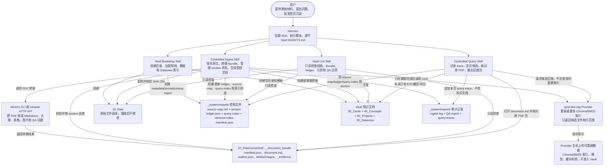

# Hermes + Obsidian 受控知识流程图

> 本文档与 `main` 和 `intranet` 两个分支的当前实现对齐。Mermaid 图可在 Obsidian 阅读视图中直接渲染，在编辑视图中修改节点和连线。

## 两个分支实际使用的环境

| 项目 | `main` | `intranet` |
| --- | --- | --- |
| Vault 位置 | 使用用户指定或当前任务中的 Vault；当前部署从 WSL 通过 `/mnt/c/...` 访问 Windows 工作区 | 固定使用 `config/intranet.json` 中的 `/opt/data/phq/testVault`，不根据 prompt 临时切换 Vault |
| Skill 位置 | 优先使用 Hermes loader 返回的实际 Skill 目录，不假定固定安装路径 | 仍优先使用 loader 返回的目录；配置的后备检查位置是 `/opt/data/skills/<skill-name>/` |
| PDF 转换 | 通常在 WSL 调用 `/usr/local/bin/mineru`，实际执行 `/root/.venvs/mineru/bin/mineru` | 默认调用 MinerU HTTP API `http://10.27.17.35:7861`；只有明确传入 `--mineru-invocation cli` 时才改用本地 CLI |
| 粗召回检索 | 通过本地 `qmd-like-rag` 命令查找候选文件和行范围 | 使用同一 `qmd-like-rag` 协议；部署可明确配置为本地命令或 HTTP 服务，不在 Skill 中猜测服务地址 |
| QMD | 只作为明确要求时的对比实验，不是默认 Provider | 不部署 QMD |
| 检索索引存放 | Chroma、BM25、模型和缓存保存在 WSL 本地文件系统，不放入 Windows Vault | Provider 索引保存在运行 Provider 的 Linux 主机上，默认不放入 `/opt/data/phq/testVault` |
| 用户查看原文位置 | 答案给出原 PDF 文件名、页码、相关段落和图表位置 | 除相同的 PDF 证据包外，对已验证的命中追加由 locator 生成的 `原文定位` viewer 链接 |
| 领域短语触发配置 | 从 Query Skill 的 `config/domain-routing.json` 读取 | 从 Query Skill 的 `config/intranet.json` 读取；同一文件还保存固定 Vault 和 viewer 地址 |
| Vault 中是否放 Skill 副本 | Bootstrap 保留可选的 `--copy-skill-note` 用法 | 运行时 Skill 始终位于 `/opt/data/skills/<skill-name>/`，不把 Skill 或安装路径复制进 Vault |

`qmd-like-rag` 是独立安装的检索 Provider，不是第五个 Skill。Vault 内只保存可审计的检索配置和索引状态；可重建的向量、BM25 索引和模型文件保存在 Provider 主机上。

## 从建库、摄取到查询的完整流程

```mermaid
flowchart LR
    START(["用户提供材料或提出问题"])

    subgraph ENV["选择当前 Git 分支对应的运行环境"]
        direction TB
        E0{"当前分支"}
        EM["main<br/>使用任务中指定的 Vault<br/>WSL 访问 /mnt/c/..."]
        EI["intranet<br/>固定 Vault: /opt/data/phq/testVault<br/>后备 Skill 根目录: /opt/data/skills"]
        E0 --> EM
        E0 --> EI
    end

    subgraph BOOT["阶段一｜初始化一个可受控摄取的 Obsidian Vault"]
        direction TB
        B0{"目标 Vault 是否已有标准目录和治理文件？"}
        B1["选择 general 或 meeting profile"]
        B2["创建 10_Raw、30_Cards、40_Concepts、50_Projects、90_Dataview 和 _system"]
        B3["写入 AGENTS.md、README 和 hermes-ingest-rules.md<br/>concept registry、文档模板、Dataview 索引和 setup report"]
        B0 -- "否" --> B1 --> B2 --> B3
    end

    subgraph INGEST["阶段二｜把原始材料转成可追溯的 Vault 文档"]
        direction TB
        I0["读取 AGENTS.md、ingest rules 和 concept registry<br/>检查 10_Raw 副本、Bundle、source map 和 section ledger"]
        I1["把外部原文原样复制到 10_Raw<br/>比较复制前后 SHA-256，不覆盖同名不同内容"]
        I2{"原始材料是什么格式？"}
        IMD["Markdown<br/>直接从 10_Raw 副本读取"]
        IPDF["PDF 或复杂手册<br/>main: 本地 MinerU CLI<br/>intranet: 默认 MinerU HTTP API"]
        IIMG["扫描页、截图或图像文档<br/>生成 Image Bundle，OCR 内容默认需 QA"]
        IOTHER["Word、PPT、Excel、HTML 等<br/>用 MarkItDown 生成 10_Raw/converted 下的 Markdown"]
        IB["生成 Bundle v2<br/>manifest.json + document.md + outline.json + tables/images + _evidence"]
        IV{"运行 validate_document_bundle.py<br/>结果是 pass、warn 还是 fail？"}
        IF["fail<br/>只替换失败的转换产物，不动 10_Raw<br/>重试一次；仍失败则记录 QA/失败报告"]
        IL["创建或对账 source-map.md 和 section-ledger.json<br/>按内容 hash 标记 pending、stale、qa_required 或已完成"]
        IC["用 expected-revision 领取一个 section 为 in_progress<br/>只读该 section 拥有的 document.md 行范围"]
        IA["需要时打开该 section 引用的表格或图片<br/>公式、跨页表格和图内容核对原 PDF 页"]
        IO["创建或更新具体文件<br/>30_Cards 知识卡、40_Concepts 稳定概念、50_Projects 项目笔记或 _system/reports 索引/报告"]
        IR["对比新输出与已有卡片、概念和项目<br/>优先补充引用、来源和关系，不创建近似重复文件"]
        IS["有多个相关来源时，比较共同对象、参数、接口和冲突<br/>只用已通过的 section 生成跨来源卡片或候选概念评审"]
        ID["将 section 结束为 ingested、qa_required 或 skipped<br/>记录输出路径，增加 ledger revision，写 ingest log"]
        IH["可选生成 _system/reports/query-index/source-name.json<br/>只供 section 导航，失败不改变摄取结果"]
        IQ["每个来源完成后或相关批次结束时<br/>调用 sync_retrieval_index.py 增量同步 qmd-like-rag<br/>在 Vault 写 retrieval-index-manifest.json"]

        I0 --> I1 --> I2
        I2 --> IMD --> IL
        I2 --> IPDF --> IB --> IV
        I2 --> IIMG --> IB
        I2 --> IOTHER --> IL
        IV -- "pass / warn" --> IL
        IV -- "fail" --> IF
        IF -. "重试成功" .-> IV
        IL --> IC --> IA --> IO --> IR --> IS --> ID
        ID --> IH
        ID --> IQ
    end

    subgraph LINT["阶段三｜在摄取后或查询前检查 Vault 是否可用"]
        direction TB
        L0["选择 post-ingest、query-ready、strict 或 qa-review"]
        L1["读取并检查目录、治理文件、Bundle、ledger、source map、frontmatter、引用和 QA 边界"]
        L2{"检查结果"}
        LP["pass 或 pass-with-warnings<br/>可继续查询，同时保留已声明的 QA 限制"]
        LE["errors<br/>列出具体文件和规则错误；Lint 本身不修改 Vault"]
        L0 --> L1 --> L2
        L2 --> LP
        L2 --> LE
    end

    subgraph QUERY["阶段四｜查找候选范围、回到原 PDF 核验并回答"]
        direction TB
        Q0["解析 Vault 和问题类型<br/>intranet 固定使用 /opt/data/phq/testVault"]
        QT["默认在 _system/reports/query-traces 启动本次 trace<br/>只有用户明确 no-trace 或 Vault 不可写时才跳过"]
        QG["读 AGENTS.md 和相关查询规则<br/>搜索 30_Cards、40_Concepts 和 50_Projects 中的已有结论"]
        QN{"问题是否只询问 Vault 治理/元数据，<br/>不包含任何源文档事实？"}
        QR["原有报告导航<br/>搜索 source map、spec index、section ledger 和 ingest log<br/>取得文档、section、页码和 QA 状态"]
        QC["粗召回<br/>retrieve_candidates.py 调用 qmd-like-rag<br/>返回候选 Vault 文件和行范围"]
        QH["分层定位<br/>locate_source_sections.py 读 query-index<br/>按文档和 section 标题/路径定位候选"]
        QM["合并三路候选，按文档、section 和重叠行范围去重<br/>将粗召回 chunk 扩展到 ledger 中完整 section"]
        QX["只在合并后的范围内做精确词搜索<br/>重新打开当前 document.md，不把 Provider/query-index 当证据"]
        QV["核对原 PDF 文件名、原 PDF 页码、相关段落<br/>需要时核对图/表标题和页面位置"]
        QA["将每条结论标记为 clear、source-backed、needs-qa 或 gap<br/>生成带原 PDF 证据包的答案"]
        QI["intranet 且 locator 返回有效 viewer_url 时<br/>在答案末尾附上已实际使用命中的「原文定位」链接"]
        QF["将 trace 结束为 completed、failed 或 incomplete<br/>确认 trace Markdown 确实已写入"]
        QW{"用户是否明确要求把结果沉淀到 Vault？"}
        QWC["生成 query-writeback candidate<br/>后续必须由 Controlled Ingest 重新核对来源后才能写卡片/概念"]

        Q0 --> QT --> QG --> QN
        QN -- "否：回答源文档事实" --> QR
        QN -- "否：需要查找源文档" --> QC
        QN -- "否：需要查找源文档" --> QH
        QR --> QM
        QC --> QM
        QH --> QM
        QM --> QX --> QV --> QA
        QN -- "是：可直接回答治理/元数据问题" --> QA
        QA --> QI --> QF --> QW
        QW -- "是" --> QWC
    end

    START --> E0
    EM --> B0
    EI --> B0
    B0 -- "是" --> I0
    B3 --> I0
    ID --> L0
    LP --> Q0
    LE -. "用另一次受控修复处理错误后重新 Lint" .-> L0
    QWC -. "作为新的摄取输入" .-> I0
```

### Query 中哪些串行，哪些并行

- 总体串行：启动 trace → 读已有卡片/概念/项目 → 找候选范围 → 打开当前原文 → 核对原 PDF 页 → 生成答案 → 结束 trace。
- 局部并行：需要来源证据时，原有 source-map/spec-index/ledger 报告导航、`retrieve_candidates.py` 调用 qmd-like-rag 粗召回、`locate_source_sections.py` 使用 query-index 分层定位，共同提供候选范围。三路结果合并后才读原文。
- 精确编号或逐字短语可跳过粗召回，直接用传统/分层搜索。缺口、完整性或审计问题不能只看 Provider top-k。
- qmd-like-rag 不可用时，记录 fallback，继续分层和传统搜索，不因 Provider 失败而停止回答。

## 辅助关系图：谁调用什么，读写哪些文件

## 四个 Skill 的具体输入与输出

| Skill | 输入 | 实际执行的事 | 输出 |
| --- | --- | --- | --- |
| `hermes-obsidian-vault-bootstrap` | Vault 路径或 intranet 固定路径；`general`/`meeting` profile | 创建目录，写入 AGENTS.md、prompts、metadata registry、templates、Dataview 页和 setup report | 一个空的、可执行摄取规则的 Vault |
| `hermes-obsidian-controlled-ingest` | 外部材料、Vault 中已有原文、Bundle 或 query-writeback candidate | 校验原文，转换 Bundle，按 ledger section 读取，核对 QA，创建/更新知识文档，同步检索索引 | Bundle、source map、section ledger、卡片/概念/项目/报告、ingest log、索引状态 |
| `hermes-obsidian-vault-lint` | Vault 和检查 profile | 只读验证目录、Bundle、ledger、source map、frontmatter、证据引用和 QA 限制 | `pass`、`pass-with-warnings` 或包含具体文件/规则的 errors |
| `hermes-obsidian-controlled-query` | 用户问题和可选范围限制 | 启动 trace，读已有文档，并行运行粗召回和分层定位，合并候选，核对原 PDF，结束 trace | 带 PDF 页级证据包的答案、不确定性/缺口、query trace；intranet 可附已验证的 viewer 链接 |

## 编辑说明

- 修改节点文字：直接编辑 `[...]` 或 `{...}` 中的内容。
- 增加节点：新建 `X["节点名"]`，再使用 `A --> X --> B` 连线。
- 改为上下布局：将 `flowchart LR` 改为 `flowchart TB`。
- 大块标题使用“阶段一｜…”，不使用“1. …”，避免某些 Obsidian/Mermaid 版本将标题误解析为 Markdown 列表。
