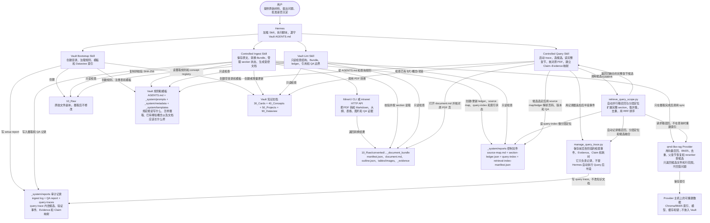

# Hermes + Obsidian 受控知识流程图

> 本文档与 `main` 和 `intranet` 两个分支的当前实现对齐。Mermaid 图可在 Obsidian 阅读视图中直接渲染，在编辑视图中修改节点和连线。

## 两个分支实际使用的环境

| 项目 | `main` | `intranet` |
| --- | --- | --- |
| Vault 位置 | 使用用户指定或当前任务中的 Vault；当前部署从 WSL 通过 `/mnt/c/...` 访问 Windows 工作区 | 固定使用 `config/intranet.json` 中的 `/opt/data/phq/testVault`，不根据 prompt 临时切换 Vault |
| Skill 位置 | 优先使用 Hermes loader 返回的实际 Skill 目录，不假定固定安装路径 | 仍优先使用 loader 返回的目录；配置的后备检查位置是 `/opt/data/skills/<skill-name>/` |
| PDF 转换 | 通常在 WSL 调用 `/usr/local/bin/mineru`，实际执行 `/root/.venvs/mineru/bin/mineru` | 默认调用 MinerU HTTP API `http://10.27.17.35:7861`；只有明确传入 `--mineru-invocation cli` 时才改用本地 CLI |
| 粗召回检索 | 通过 `/usr/local/bin/qmd-like-rag` 调用独立虚拟环境 `/root/.venvs/qmd-like-rag`，查找候选文件和行范围 | 使用同一 `qmd-like-rag` 协议；部署可明确配置为本地命令或 HTTP 服务，不在 Skill 中猜测服务地址 |
| QMD | 只作为明确要求时的对比实验，不是默认 Provider | 不部署 QMD |
| 检索索引存放 | 示例配置使用 `/root/.local/state/qmd-like-rag`；Chroma、BM25、模型和缓存不放入 Windows Vault | 示例配置使用 Vault 外的同级目录 `/opt/data/phq/qmd-like-rag-state`，不放入 `/opt/data/phq/testVault` |
| 用户查看原文位置 | 答案给出原 PDF 文件名、页码、相关段落和图表位置 | 除相同的 PDF 证据包外，对已验证的命中追加由 locator 生成的 `原文定位` viewer 链接 |
| 领域短语触发配置 | 从 Query Skill 的 `config/domain-routing.json` 读取 | 从 Query Skill 的 `config/intranet.json` 读取；同一文件还保存固定 Vault 和 viewer 地址 |
| Vault 中是否放 Skill 副本 | Bootstrap 保留可选的 `--copy-skill-note` 用法 | 运行时 Skill 始终位于 `/opt/data/skills/<skill-name>/`，不把 Skill 或安装路径复制进 Vault |

`qmd-like-rag` 是独立安装的检索 Provider，不是第五个 Skill。Vault 内只保存可审计的检索配置和索引状态；可重建的向量、BM25 索引和模型文件保存在 Provider 主机上。

## 从建库、摄取到查询的完整流程

```mermaid
flowchart TB
    START(["用户提供材料或提出问题"])
    TASK{"本次要新建 Vault、摄取材料、检查 Vault，还是查询已有知识？"}

    subgraph ENV["选择当前 Git 分支对应的运行环境"]
        direction TB
        E0{"当前分支"}
        EM["main<br/>使用任务中指定的 Vault<br/>WSL 访问 /mnt/c/..."]
        EI["intranet<br/>固定 Vault: /opt/data/phq/testVault<br/>后备 Skill 根目录: /opt/data/skills"]
        E0 --> EM
        E0 --> EI
    end

    subgraph BOOT["阶段一｜初始化一个可受控摄取的 Obsidian Vault"]
        direction TB
        B0{"目标 Vault 是否已有标准目录和治理文件？"}
        B1["选择 profile（建库时使用的一组目录、规则和模板预设）<br/>general（通用知识库）或 meeting（会议纪要和行动项）"]
        B2["创建 10_Raw、30_Cards、40_Concepts、50_Projects、90_Dataview 和 _system"]
        B3["写入 AGENTS.md（规定 Agent 能读写什么）和 hermes-ingest-rules.md（摄取步骤）<br/>concept registry（已批准概念清单）、文档模板、Dataview 索引和 setup report"]
        B4["Bootstrap 完成<br/>只创建空的受控 Vault，不自动导入原始材料"]
        B0 -- "否" --> B1 --> B2 --> B3 --> B4
    end

    subgraph INGEST["阶段二｜把原始材料转成可追溯的 Vault 文档"]
        direction TB
        I0["读取 AGENTS.md、ingest rules 和 concept registry<br/>检查 10_Raw 中是否已有同一份原文"]
        ICTRL["检查是否已有 Bundle（一次转换生成的结构化文档包）<br/>source-map.md（给人查看章节、页码和处理状态）<br/>section（按大纲划分、可单独领取处理的章节单元）<br/>section-ledger.json（给程序记录每个 section 的状态、版本和输出）"]
        ISTATE{"根据原文 SHA-256、Bundle 校验结果和 ledger 状态<br/>判断本次是新导入、补转换、断点续做、已完成对账，还是 query 结果写回"}
        I1["把外部原文原样复制到 10_Raw<br/>比较复制前后 SHA-256（文件内容指纹，相同表示复制内容一致）<br/>不覆盖同名但内容不同的文件"]
        I2{"原始材料是什么格式？"}
        IMD["Markdown<br/>直接从 10_Raw 副本读取"]
        IPDF["PDF 或复杂手册<br/>main: 本地 MinerU CLI<br/>intranet: 默认 MinerU HTTP API"]
        IIMG["扫描页、截图或图像文档<br/>生成 Image Bundle，OCR 内容默认需 QA（人工质量核验）"]
        IOTHER["Word、PPT、Excel、HTML 等<br/>用 MarkItDown 生成 10_Raw/converted 下的 Markdown"]
        ICLASS["根据实际内容判断它是短知识、方法、项目材料、工程手册、字段规范还是 QA 材料<br/>再决定是创建/更新卡片、概念、项目笔记、规范索引还是只写 QA 报告"]
        IWB["处理 query-writeback candidate（查询阶段发现、尚未批准写进知识库的候选）时<br/>把候选只当作「要检查什么」的线索，重新打开它引用的原文<br/>搜索已有 Cards/Concepts/Projects 查重，证据不足就跳过或只写 QA/缺口项"]
        IB["生成 Bundle v2（保留统一正文、章节结构、图表和转换证据的文档包）"]
        IBM["manifest.json（记录原文指纹、转换方式和包内文件）<br/>document.md（统一后的可检索正文）<br/>outline.json（记录章节树、页码和正文行范围）<br/>tables/images（表格和图片） + _evidence（只在 QA 时查看的转换证据）"]
        IV{"运行 validate_document_bundle.py<br/>pass（包结构可用）、warn（可继续，但相关内容保留 QA 限制）<br/>还是 fail（包不可用，不能继续下游写入）？"}
        IF["fail<br/>只替换失败的转换产物，不动 10_Raw<br/>重试一次；仍失败则记录 QA/失败报告"]
        IL["如果没有 source-map.md 和 section-ledger.json 就创建<br/>如果已有，就把当前 Bundle 的每个 section 与旧台账逐项比较<br/>按内容指纹保留或更新状态：pending（等待处理）、<br/>stale（原文变了，旧输出要复查）、qa_required（必须人工核验，暂不能当权威事实）或已完成<br/>每次修改台账时 revision（台账版本号）自加 1"]
        IC["先读取台账当前 revision，再申请把一个等待处理的 section<br/>改为 in_progress（本次任务正在处理）<br/>如果版本号已被另一会话改变，停止写入并重新读台账，避免两次任务互相覆盖"]
        IREAD["按台账中的 content_ranges（该章节自己拥有的正文行段）<br/>只读 document.md 中这些行<br/>父章节的大范围只用来定位，不重复摄取子章节"]
        IA["需要时打开该 section 引用的表格或图片<br/>公式、跨页表格和图内容核对原 PDF 页"]
        IO["创建或更新具体文件<br/>30_Cards 知识卡、40_Concepts 稳定概念、50_Projects 项目笔记或 _system/reports 索引/报告"]
        IR["对比新输出与已有卡片、概念和项目<br/>优先补充引用、来源和关系，不创建近似重复文件"]
        IS["有多个相关来源时，比较共同对象、参数、接口和冲突<br/>只用已通过的 section 生成跨来源卡片或候选概念评审"]
        ID["如果本次使用 section ledger，将 section 结束为 ingested（已生成并记录输出）、<br/>qa_required（等待人工核验）或 skipped（有理由地跳过）<br/>无论是否使用 ledger，都记录创建/更新/复用/跳过的文件<br/>并写 ingest log（本次摄取做了什么的审计记录）"]
        IH["可选生成 query-index（按文档/章节标题和层级定位候选的可重建索引）<br/>位于 _system/reports/query-index/source-name.json<br/>只供导航，失败不改变摄取结果"]
        IQ["每个来源完成后或相关批次结束时<br/>调用 sync_retrieval_index.py，让 qmd-like-rag（结合向量、BM25 和重排的粗召回 Provider）<br/>只更新本次新增、修改或删除的可检索文档<br/>在 Vault 写 retrieval-index-manifest.json（记录索引使用的配置、模型指纹、文档数和同步结果）"]

        I0 --> ICTRL --> ISTATE
        ISTATE -- "外部新原文，10_Raw 无相同指纹副本" --> I1 --> I2
        ISTATE -- "10_Raw 已有同一原文，但还没有可用转换结果" --> I2
        ISTATE -- "已有 Bundle：每次会话重新校验" --> IV
        ISTATE -- "ledger 已有 pending/in_progress/stale：重新对账后续做" --> IV
        ISTATE -- "所有 section 已结束：不重复摄取" --> IR
        ISTATE -- "查询阶段有待复审的写回候选" --> IWB --> ICLASS
        I2 --> IMD --> ICLASS
        I2 --> IPDF --> IB --> IBM --> IV
        I2 --> IIMG --> IB
        I2 --> IOTHER --> ICLASS
        ICLASS --> IO
        IV -- "pass / warn" --> IL
        IV -- "fail" --> IF
        IF -. "重试成功" .-> IV
        IL --> IC --> IREAD --> IA --> IO --> IR --> IS --> ID
        ID --> IH
        ID --> IQ
    end

    subgraph LINT["阶段三｜在摄取后或查询前检查 Vault 是否可用"]
        direction TB
        L0["选择检查严格程度<br/>post-ingest（摄取后查破损 Bundle、stale 和未结束章节）<br/>query-ready（查询前确认每条知识能追到来源）<br/>strict（发布、归档或交付前把开放 QA 和弱引用视为错误）<br/>qa-review（集中列出等待人工核验的章节和证据）"]
        L1["只读检查目录、治理文件、Bundle、section ledger 和 source map<br/>frontmatter（Markdown 开头记录类型、来源和状态的 YAML 字段）<br/>引用（结论能指向原 PDF、页码和 section）<br/>QA 边界（有风险的公式、表格和图内容不能被标成权威事实）"]
        L2{"检查结果"}
        LP["pass 或 pass-with-warnings<br/>可继续查询，同时保留已声明的 QA 限制"]
        LE["errors<br/>列出具体文件和规则错误；Lint 本身不修改 Vault"]
        L0 --> L1 --> L2
        L2 --> LP
        L2 --> LE
    end

    subgraph QUERY["阶段四｜查找候选范围、回到原 PDF 核验并回答"]
        direction TB
        Q0["确定 Vault 和问题类型<br/>intranet 固定使用 /opt/data/phq/testVault<br/>参数、公式、表格或图片问题一律当作 evidence 查询（必须回到原文页核验的证据型查询）"]
        QB["一条消息含多个独立问题时<br/>按用户顺序一题一题执行，每题建立自己的 trace（该问题的查询审计记录）<br/>前一题结束并验证 trace 文件后才开始下一题"]
        QT["默认在 _system/reports/query-traces 启动 trace（本次查询的审计记录，<br/>记录走了哪条检索路线、选了哪些候选、核对了哪些证据）<br/>只有用户明确 no-trace 或 Vault 不可写时才跳过"]
        QD0{"是否已知精确文件名、标准号、条款号或原文短语？"}
        QDIRECT["记录为什么跳过粗召回<br/>直接在指定文件/报告/query-index 中定位完整 section"]

        subgraph QAUTO["脚本自动执行并自动写入三个 trace 事件"]
            direction TB
            QC["粗召回<br/>retrieve_candidates.py 调用 qmd-like-rag<br/>在 Provider 内经向量召回 + BM25 + 去重 + 父章节恢复 + reranker（语义重排模型）<br/>返回候选文件和 chunk（按标题切出的较小文本片段）行范围<br/>Provider 不可用时记录 unavailable"]
            QH["分层定位<br/>locate_source_sections.py 读 query-index<br/>按文档名、section 标题和完整父子路径定位候选章节"]
            QM["retrieve_query_scope.py（并行调用上述两路并统一输出）<br/>把 Provider chunk 扩展为台账中的完整 section，再取两路并集<br/>按文档/section/重叠行范围去重<br/>用 RRF（按两路排名而不是直接相加原始分数）综合排序并记录合并/淘汰原因"]
            QC --> QM
            QH --> QM
        end

        subgraph QMANUAL["Hermes 按 Skill 说明逐步执行的范围（当前不是一个后半段自动状态机）"]
            direction TB
            QSEL["查看双路融合或直接定位得到的候选列表<br/>选出真正与问题相关的文档/章节，记录保留和排除原因"]
            QG["governed-artifact-lookup（已有知识文档检查）<br/>先查融合候选中的 30_Cards、40_Concepts 和 50_Projects<br/>再用标准号、文件名、参数名和同义词补充精确搜索"]
            QN{"已有知识文档是否能明确指向<br/>当前原 PDF、版本、section、页码和相关段落？"}
            QX["scoped-lexical-search（限定范围的精确文字搜索）<br/>已有知识不足时，只在融合候选的文档/完整 section 中<br/>搜标准号、文件名、条款、原文短语、数值、单位和同义词<br/>缺口、完整性和审计问题要主动扩大到更广范围"]
            QR["选定候选后再读控制文件<br/>source-map.md 解析原 PDF、页码、转换质量和输出<br/>section-ledger.json 解析完整正文范围、当前/stale 状态、revision、内容指纹和图表"]
            QDOC["document-reading / converted-source（读取当前转换正文）<br/>重新打开当前 document.md，读完整 ledger-owned section<br/>不只看命中的几行，不把 Provider、融合分数或 query-index 当证据"]
            QPAGE["page-asset-verification（原页和原图表核验）<br/>核对原 PDF 文件名、原 PDF 页码和相关段落<br/>数值、公式、跨页表格或图内容还要打开原表截图/页图核对"]
            QE["Evidence 记录（一条被接受的可追溯证据）<br/>用 manage_query_trace.py evidence 记录 Evidence ID、文档版本、section、<br/>原 PDF 页、表/图 block ID 和原始资产是否已核验<br/>Accepted 数量和路径由这些记录自动汇总，不手工填数"]
            QCLAIM["Claim–Evidence 映射（说明每条最终结论由哪些 Evidence ID 支持）<br/>每条最终 Claim 都必须标记 supported、unsupported 或 needs-qa"]
            QANS["answer-synthesis（把已核验证据组织成答案）<br/>clear（已有受控知识或已核验源文直接支持）<br/>source-backed（源文支持，但还没有稳定知识卡）<br/>needs-qa（原页、数值、公式或图表仍需人工核验）<br/>gap（当前 Vault 没有找到足够证据）<br/>对每条实质结论输出原 PDF 文件名、页码、相关段落和图表位置"]
            QI["intranet 且 locator 返回有效 viewer_url（指向已核对 Bundle 段落的阅读链接）时<br/>在答案末尾附上已实际使用命中的「原文定位」链接<br/>该链接只帮助定位，不替代原 PDF 证据包"]
            QF["将 trace 结束为 completed（完成）、failed（失败）或 incomplete（未走完）<br/>确认 trace Markdown 确实已写入；如有未结束计时器，不允许 finish"]
            QW{"用户是否明确要求把结果沉淀到 Vault？"}
            QWC["query-writeback candidate（查询发现的待复审写回候选）<br/>后续必须交给 Controlled Ingest 重新打开原始证据、查重和核对 QA<br/>查询阶段不直接创建卡片或概念"]

            QSEL --> QG --> QN
            QN -- "是：直接追到来源定点核验" --> QR
            QN -- "否：在融合范围内继续搜" --> QX --> QR
            QR --> QDOC --> QPAGE --> QE --> QCLAIM --> QANS --> QI --> QF --> QW
            QW -- "是" --> QWC
        end

        Q0 --> QB --> QT --> QD0
        QD0 -- "否：运行默认双路候选定位" --> QC
        QD0 -- "否：运行默认双路候选定位" --> QH
        QD0 -- "是：记录 skipped + reason" --> QDIRECT --> QSEL
        QM --> QSEL
    end

    START --> E0
    EM --> TASK
    EI --> TASK
    TASK -- "新建 Vault" --> B0
    TASK -- "摄取新材料" --> B0
    TASK -- "只做健康/验收检查" --> L0
    TASK -- "查询已有 Vault" --> Q0
    B0 -- "是：本次请求是摄取" --> I0
    B4 -. "只有本次请求还包含摄取时才继续" .-> I0
    ID -. "摄取后验收" .-> L0
    LP -. "检查后继续查询" .-> Q0
    LE -. "用另一次受控修复处理错误后重新 Lint" .-> L0
    QWC -. "作为新的摄取输入" .-> I0
```

### Query 中哪些串行，哪些并行

- 总体串行：问题分类 → 启动 trace → 自动候选定位/融合 → 候选选择 → 已有知识文档检查 → 必要时限定范围文字搜索 → 读完整章节 → 核对原 PDF/图表 → 记录 Evidence 和 Claim 映射 → 生成答案 → 结束 trace。
- 局部并行：`retrieve_query_scope.py` 同时启动 `retrieve_candidates.py`（qmd-like-rag 粗召回）和 `locate_source_sections.py`（query-index 分层定位）。两路都结束后，脚本才将 chunk 扩展到完整 section、取并集、去重和 RRF 排序。
- source-map、section ledger、spec index 和 ingest log 不是第三条自动并行召回脚本。它们在候选选定后用于解析完整行范围、页码、版本、内容指纹和 QA 状态。
- 当前自动化边界止于候选融合：`retrieve_query_scope.py` 自动写入粗召回、分层定位和候选融合三个事件；之后的选择、文字搜索、正文读取、图表核验和答案生成仍由 Hermes 执行。`manage_query_trace.py` 负责保存事件、Evidence、Claim 和计时，不会替 Hermes 自动执行后半段。
- 精确文件名、标准号、条款号或逐字短语可跳过粗召回，但要在 trace 中记录 `skipped + reason`。缺口、完整性或审计问题不能只看 Provider top-k，要扩大搜索范围。
- qmd-like-rag 不可用时，记录 `unavailable/fallback`，继续分层定位和精确文字搜索，不因 Provider 失败而停止回答。

### 实际 query trace 怎样才算把链路记完

图中的 Query 后半段是必须执行的标准步骤，但当前并没有一个脚本强制 Hermes 依次走完。审核一条 trace 时，应该能分开看到：

1. `coarse-recall` 或者明确的 `skipped/unavailable + reason`；
2. `hierarchical-candidate-location` 或者明确的 `skipped + reason`；
3. `candidate-fusion`：保留了哪些候选，哪些重复候选被合并；
4. `governed-artifact-lookup`：查了哪些 Cards、Concepts 和 Projects，为什么保留或排除；
5. `scoped-lexical-search` 或者明确说明为什么不需要；
6. `document-reading`：真正读了哪些完整 section；
7. `page-asset-verification`：数值、公式、表格或图是否核对原 PDF/原图，不涉及时也要记录为什么跳过；
8. Evidence 记录与每条 Claim 的映射；
9. `answer-synthesis` 及其耗时；
10. `finish`：状态、证据等级、简短结论和未解决问题。

同一会话的后续问题即使复用了前一题的文档范围，也不能让 retrieval timeline 留空；应记录“复用了哪一题的范围、本题是否重新打开当前源、为什么跳过某一检索步骤”。

## 辅助关系图：谁调用什么，读写哪些文件

## 四个 Skill 的具体输入与输出

| Skill | 输入 | 实际执行的事 | 输出 |
| --- | --- | --- | --- |
| `hermes-obsidian-vault-bootstrap` | Vault 路径或 intranet 固定路径；`general`/`meeting` profile | 创建目录，写入 AGENTS.md、prompts、metadata registry、templates、Dataview 页和 setup report | 一个空的、可执行摄取规则的 Vault |
| `hermes-obsidian-controlled-ingest` | 外部材料、Vault 中已有原文、Bundle 或 query-writeback candidate | 校验原文，转换 Bundle，按 ledger section 读取，核对 QA，创建/更新知识文档，同步检索索引 | Bundle、source map、section ledger、卡片/概念/项目/报告、ingest log、索引状态 |
| `hermes-obsidian-vault-lint` | Vault 和检查 profile | 只读验证目录、Bundle、ledger、source map、frontmatter、证据引用和 QA 限制 | `pass`、`pass-with-warnings` 或包含具体文件/规则的 errors |
| `hermes-obsidian-controlled-query` | 用户问题和可选范围限制 | 每题启动独立 trace；用 `retrieve_query_scope.py` 自动并行粗召回/分层定位并融合候选；Hermes 再选候选、检查治理文档、限定范围文字搜索、读完整章节、核对原 PDF/图表、记录 Evidence 并建立 Claim 映射 | 带 PDF 页级证据包的答案、不确定性/缺口、包含候选与 Claim–Evidence 关系的 query trace；intranet 可附已验证的 viewer 链接 |

## 编辑说明

- 修改节点文字：直接编辑 `[...]` 或 `{...}` 中的内容。
- 增加节点：新建 `X["节点名"]`，再使用 `A --> X --> B` 连线。
- 主图默认使用 `flowchart TB`（从上到下，适合较长的白话说明）；如需用于横向大屏，可改为 `flowchart LR`。
- 大块标题使用“阶段一｜…”，不使用“1. …”，避免某些 Obsidian/Mermaid 版本将标题误解析为 Markdown 列表。
