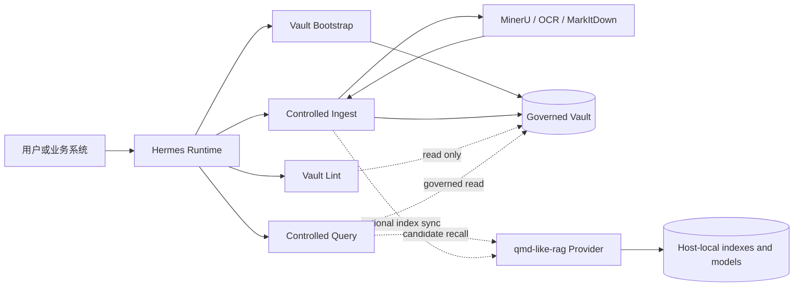
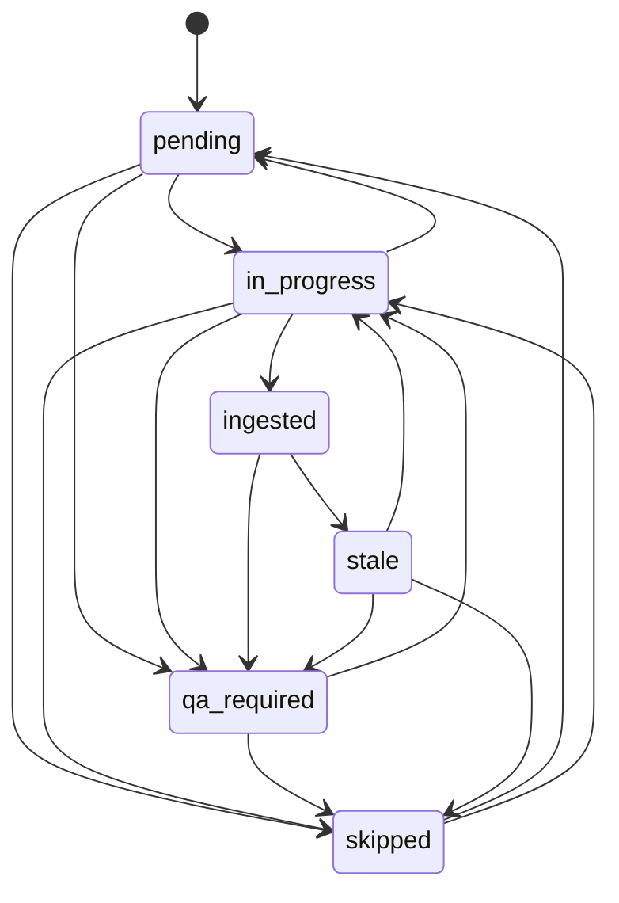

# Hermes + Obsidian 受控知识系统技术规范

## 文档控制

| 项目 | 内容 |
| --- | --- |
| 文档性质 | 项目级官方技术规范 |
| 文档状态 | 工作树技术基线；合并到目标分支后对该分支生效 |
| 基线日期 | 2026-09-01 |
| 适用范围 | `hermes-obsidian-skills` 的 `main` 与 `intranet` 分支 |
| 规范对象 | 四个 Skill、受治理 Vault、Bundle、控制面记录、Query Session、qmd-like-rag Provider 及其边界 |
| 不直接规范 | Hermes 上游产品功能、具体组织的权限系统、主机密钥、业务内容和人工审批制度 |

本文档使用“必须”“不得”表示强制要求，使用“应”表示除非有明确理由否则需要遵守的要求，使用“可以”表示可选能力。

## 1. 目的

本规范建立一份跨 Skill、跨运行环境、可用于设计评审、实现维护、部署验收和交接的统一技术基线。它主要回答以下问题：

- 系统由哪些组件组成，各自负责什么；
- 原始证据、解析结果、治理知识、索引和审计记录分别存放在哪里；
- Bootstrap、Ingest、Lint、Query 之间如何协作；
- 哪些数据结构和协议构成兼容性边界；
- `main` 与 `intranet` 的部署差异如何表达；
- 出现解析失败、证据缺口、Provider 不可用或并发状态冲突时如何降级；
- 什么条件下可以认为一次变更或一次部署通过验收。

本文档不复制全部命令参数。当前操作接口以相应 [`SKILL.md`](../DOCUMENTATION.md) 和直接 reference 为准；本规范负责定义不应被局部实现随意改变的系统级原则与技术合同。

## 2. 规范权威性与冲突处理

### 2.1 文档层级

| 层级 | 资料 | 责任 |
| --- | --- | --- |
| 系统技术基线 | 本规范 | 定义架构、组件边界、数据权威、接口和验收原则 |
| 运行入口 | 各 Skill 的 `SKILL.md` | 定义任务触发、正常路径、强制门禁和失败回退 |
| 专题合同 | 各 Skill 的 `references/` | 定义 Bundle、ledger、trace、证据、输出等细节 |
| 部署配置 | 当前分支 `config/`、主机部署配置、Vault 控制面 | 定义当前环境的 Vault、Provider、模型、开关与传输方式 |
| 可执行实现 | `scripts/`、`qmd-like-rag/src/` | 实现命令和数据结构 |
| 验证证据 | `tests/`、Lint/doctor 输出和验收记录 | 证明实现符合合同 |

### 2.2 冲突规则

1. 用户明确要求、适用的 `AGENTS.md` 和安全边界优先于普通操作说明。
2. 当前分支配置不得被另一分支文档或主机假设覆盖。
3. 本规范与 `SKILL.md`、schema、脚本或测试不一致时，视为项目缺陷；不得在运行时静默选择一个版本并长期带病运行。
4. 修复缺陷时应同时更新实现、直接 reference、测试、流程图和文档索引中受影响的内容。
5. 性能迭代历史不构成当前操作入口。Query 的当前路径以 Controlled Query `SKILL.md` 和 `query-workflow.md` 为准。

## 3. 系统范围

### 3.1 系统目标

系统在原始文档与智能问答之间建立受控知识加工层，使专业知识具备以下属性：

- 原始材料保留且可校验；
- 文档结构、页面、表格、图片和公式具有可追溯关系；
- 知识产物按材料性质进入明确目录；
- 摄取过程可恢复、可去重、可发现陈旧状态；
- 查询能够回到原始 PDF 和页码；
- 解析风险、证据冲突和人工复核事项不会被隐藏；
- 检索 Provider 可以替换或重建，而不改变 Vault 的权威内容。

### 3.2 非目标

本系统不以以下事项为目标：

- 自动把所有材料都生成摘要、卡片或概念页；
- 用向量索引代替治理知识和原始证据；
- 在 Query 阶段自动修复、重建或同步索引；
- 让转换后的 Markdown、query-index、trace 或 viewer URL取代原始 PDF；
- 自动批准正式概念、高风险工程参数或跨来源冲突；
- 把运行时 Skill、模型、缓存和数据库复制进 Vault；
- 在缺少证据时通过模型常识补足 Vault 事实。

## 4. 核心术语

| 术语 | 定义 |
| --- | --- |
| Governed Vault | 按规定目录、元数据、证据和审计合同维护的 Obsidian/Markdown 知识库 |
| Raw Source | 保存在 `10_Raw/` 的原始材料副本；内容权威层，不因摄取而改写 |
| Bundle | 原始材料的结构化派生表示，包含统一正文、章节、图表和转换证据 |
| Governed Artifact | `30_Cards/`、`40_Concepts/`、`50_Projects/` 等可长期维护的知识产物 |
| Source Map | 面向人的来源、章节和处理状态控制页 |
| Section Ledger | 面向程序的章节状态、修订、内容指纹和输出台账 |
| Query Index | 可重建的分层章节导航索引，不是事实证据 |
| Query Trace | 一次受控查询的候选、读取、证据、Claim、计时和结论审计记录 |
| Provider | 通过稳定协议提供候选召回的独立服务或命令；当前实现为 qmd-like-rag |
| Control Plane | Vault 中可审计的配置、指纹、状态和报告 |
| Data Plane | Provider 主机上的向量/BM25 索引、模型、缓存、锁和其他可重建运行数据 |
| QA | 对解析、公式、表格、图片、证据链或专业判断进行的质量核验 |

## 5. 总体架构



架构必须维持以下分离：

1. **来源与派生分离**：原始文件不得被 Bundle 或知识产物覆盖。
2. **治理与召回分离**：Vault 保存权威内容和控制记录；Provider 只提供候选。
3. **写入与查询分离**：Ingest 负责治理写入；Query 除当前 trace 外保持只读。
4. **Skill 与 Vault 分离**：运行时 Skill 从 loader 解析，不从 Vault 内查找或复制执行脚本。
5. **通用合同与部署配置分离**：Skill 使用运行时中立路径；具体 Vault、命令、HTTP 地址和模型由分支及主机配置确定。

## 6. 组件职责

| 组件 | 核心职责 | 允许写入 | 禁止行为 |
| --- | --- | --- | --- |
| Vault Bootstrap | 创建标准目录、规则、模板、注册表、Dataview 和 setup report；engineering profile 创建 revision-0 JSON 文档治理控制面 | 新 Vault 的治理骨架 | 自动摄取业务原文；覆盖或升级已有治理控制面；把运行时 Skill 路径固化为可移植 Vault 内容 |
| Controlled Ingest | 保存原件、转换、校验、管理 ledger、通过治理管理器登记文档/版本/来源、生成或更新治理知识、记录 ingest/QA、可选同步 Provider | `10_Raw/` 新原件、`10_Raw/converted/` 派生物、治理注册表、治理目录和 `_system/reports/` | 直接手改治理注册表；覆盖冲突原件；跳过 Bundle/ledger 门禁；把 QA 内容静默提升为权威事实 |
| Vault Lint | 按 profile 只读检查 Vault 健康、证据链、QA 边界及可选 engineering 治理不变量 | 无 | 自动修复 Vault 或改变业务状态 |
| Controlled Query | 融合候选、自动检查首窗、形成可追溯答案并写 trace | 当前查询 trace | 修改治理知识；查询时同步索引；补检索绕过单遍边界 |
| MinerU/OCR/MarkItDown | 把外部格式转换为可检查的派生表示 | 转换输出目录 | 决定知识产物、批准概念或替代人工专业判断 |
| qmd-like-rag | 建立可重建索引并按协议返回候选路径和范围 | Provider 主机数据面 | 生成最终业务答案；把索引当成证据；在 Query 调用中隐式重建 |

## 7. Vault 存储模型

标准 Vault 至少包含：

```text
<vault>/
  10_Raw/
    converted/
  30_Cards/
  40_Concepts/
  50_Projects/
  90_Dataview/
  _system/
    vault.json                 # engineering profile only
    metadata/
    prompts/
    reports/
    templates/
```

`meeting` profile 可以增加会议笔记等专用目录。`engineering` profile 还会在 `_system/metadata/`
创建治理 schema、来源机构表和 JSON 文档注册表；具体差异以 Bootstrap profile 为准。

### 7.1 数据权威顺序

1. 原始 PDF 或其他原始文件是事实与视觉内容的最终权威。
2. 通过质量门禁的 Bundle 是内部提取和定位载体，不取代原件。
3. 治理知识是长期维护的结论层，必须保留到来源的证据链。
4. engineering 文档注册表是逻辑文档身份、版本状态、来源事件和存储引用的当前治理权威；它不替代原件的事实权威。
5. source map、ledger、query-index、retrieval manifest 和 query trace 是控制、导航或审计记录，不得单独支撑业务事实。
6. Provider 候选、相似度分数和 viewer URL 只帮助导航，不构成回答证据。

### 7.2 原始材料保护

- 外部来源进入 Vault 时必须复制原件并记录内容指纹。
- 同名但内容不同的文件不得静默覆盖。
- 转换、修订和人工校正必须产生独立派生物。
- 原始 PDF 与完整原始 MinerU 输出在复核场景中均应保持不可变。

## 8. 核心数据合同

| 合同 | 当前版本 | 权威位置 | 主要作用 |
| --- | --- | --- | --- |
| Bundle manifest/outline | `2.0` | Bundle `manifest.json`、`outline.json` | 描述来源、结构、页码、图表、质量和派生文件 |
| Section ledger | `1.0` | `_system/reports/*.section-ledger.json` | 记录章节状态、内容指纹、revision、QA 和输出 |
| Query index | `1.0` | `_system/reports/query-index/*.json` | 按文档和章节层级定位候选 |
| Retrieval index manifest | `1.0` | `_system/reports/retrieval-index-manifest.json` | 记录 Provider、配置/模型/语料/索引指纹与最近状态 |
| Query trace | `1.5` | `_system/reports/query-traces/` | 记录候选、证据包、Claim、事件、耗时和结论 |
| Vault Lint output | `1.0` | `lint_vault.py --json` 输出 | 为 CI、验收和修复计划提供稳定检查结果 |
| Document governance | `1.0` / `hermes-governance/v1` | `_system/vault.json` 及其声明的 schema、机构表和 registry | 定义 Vault 隔离、文档/版本/资源身份、来源事件、状态和未来 SQL 映射 |
| Coarse recall protocol | `hermes-coarse-recall/v1` | Provider 请求/响应 | 在 Skill 与 Provider 之间传递候选，不传递最终答案 |

修改以下任一事项时，必须进行兼容性评审：必需字段、字段语义、状态含义、状态转换、协议版本、CLI 必需参数、退出码或目录约定。

## 9. Bundle 技术合同

复杂工程 PDF 应使用 engineering Bundle：

```text
document_bundle/
  manifest.json
  document.md
  outline.json
  images/
  tables/
  _evidence/
    blocks.jsonl
    mineru/
```

强制规则：

- `document.md` 是 Bundle 内唯一统一正文，不为每个 section 复制一份正文。
- `outline.json` 的 section 必须指向稳定的正文范围、页面和资产。
- 父范围可以导航，但 ingestion unit 必须使用自身拥有的非重叠 `content_ranges`。
- 公式、跨页表格和图片内部语义需要保留明确 QA 边界。
- `_evidence/` 只在针对性质量核验时读取，不进入默认上下文。
- Bundle validation 为 `fail` 时必须阻断下游知识写入；`warn` 可以继续建立控制记录，但受影响内容不得被静默提升为权威知识。
- 修订 MinerU 输出时必须保留机器原始层，在隔离的 review 层记录变更并生成候选 Bundle；不得直接覆盖有效生产 Bundle。

详细合同见 [`mineru-pdf-bundle.md`](../hermes-obsidian-controlled-ingest/references/mineru-pdf-bundle.md)、[`image-bundle.md`](../hermes-obsidian-controlled-ingest/references/image-bundle.md) 和 [`mineru-output-review.md`](../hermes-obsidian-controlled-ingest/references/mineru-output-review.md)。

## 10. Section Ledger 状态机

Section ledger 使用 optimistic revision 防止并发覆盖。领取 section 前必须读取当前 revision，并使用期望 revision 将其改为 `in_progress`。

| 状态 | 含义 |
| --- | --- |
| `pending` | 可领取，尚未产生正式输出 |
| `in_progress` | 已由一次摄取运行领取 |
| `ingested` | 已完成且至少登记一个输出 |
| `qa_required` | 等待解析或证据人工核验 |
| `skipped` | 已按明确原因排除 |
| `stale` | 来源或章节内容变化，旧状态/输出需要重新核对 |



附加约束：

- `ingested` 必须记录输出；
- `skipped` 必须记录原因；
- `qa_required` 必须记录 QA 项或说明；
- 内容变化后，已完成或处理中 section 必须变为 `stale`，不得沿用旧结论；
- 崩溃遗留的 `in_progress` 必须先核对日志，再完成或显式退回。

## 11. 四条核心工作流

### 11.1 Bootstrap

```text
resolve target and profile
-> validate destination
-> create governed structure
-> write rules/templates/registries/indexes
-> write setup report
```

Bootstrap 只建立空的治理结构。目标已存在时必须遵守覆盖保护；普通材料导入必须切换到 Controlled Ingest。
`engineering` profile 创建 JSON repository 并标记 `readiness: draft`；Bootstrap 不登记业务文档，
也不创建空置 SQLite/PostgreSQL。已有治理 JSON 即使在 `--force-empty` 下也不得覆盖。

### 11.2 Controlled Ingest

```text
detect source state
-> preserve raw source
-> choose conversion route
-> validate Bundle
-> reconcile source map and ledger
-> claim bounded section
-> read evidence and existing knowledge
-> create/update/reuse/skip governed artifacts
-> finish ledger and write ingest/QA record
-> optionally sync Provider when ingest adapter is enabled
```

摄取必须优先更新已有产物和关系，不得因为新来源出现就创建近似重复卡片或概念。Query 产生的 writeback candidate 只能作为新的摄取输入；Ingest 必须重新打开原始证据、查重并执行 QA。

### 11.3 Vault Lint

Lint 始终只读。四个标准 profile 为：

| Profile | 用途 |
| --- | --- |
| `post-ingest` | 摄取后检查破损 Bundle、未结束状态、stale 和 QA 边界 |
| `query-ready` | 查询前检查来源、ledger/source map 对齐和引用合同 |
| `strict` | 发布、归档或交接前把开放状态和弱 QA 边界提升为错误 |
| `qa-review` | 汇总需要人工核验的内容并安排复核 |

输出状态为 `pass`、`pass-with-warnings`、`fail` 或 `internal-error`。自动化消费者必须依赖 JSON 的 `status`、`summary` 和 `issues[].code`，不得解析控制台排版。

若存在 `_system/vault.json`，Lint 还必须检查 `hermes-governance/v1` 控制面、来源机构别名、稳定
身份、内容哈希、存储 URI、状态词表、来源引用、单 active 版本和无环 supersedes 关系。缺少该文件的
旧 Vault 进入 `legacy` 模式，不因此失败；`readiness: draft` 在 strict profile 中为错误，其余为警告。

### 11.4 治理持久化演进

阶段 1 的权威后端为 JSON，但调用方应面向 `hermes-governance/v1` repository 合同，而不是把文件
布局当业务 API。阶段 2 已由 Controlled Ingest 的治理管理器实现 revision 冲突检查、共享互斥锁、
全状态校验、actor 审计事件和原子写入；普通 Ingest 不得直接修改 registry。阶段 3 再把 Bundle
处理流程与这些命令自动联动。阶段 5.5 才实现 SQLite/PostgreSQL adapter，并通过 JSON export/import
切换唯一权威后端。
禁止长期双写。数据库文件、连接凭据和迁移运行环境保存在 Vault 外。

### 11.4 Controlled Query

普通问题的当前主路径为：

```text
bootstrap once per request
-> query (create trace + parallel candidate routes + fusion + automatic first-window inspect)
-> synthesize minimum supported claims
-> finalize atomically
```

强制规则：

- `query` 自动检查前三个紧凑候选，候选不足三个时全部检查；模型没有候选选择步骤。
- qmd-like-rag 粗召回与 hierarchical routing 是导航路线，候选本身不是证据。
- 正常流程不得调用兼容 `begin`/独立 `inspect`，不得打开候选 sidecar 恢复更多范围。
- supplemental retrieval 和第二次 inspect 被禁止；首窗证据不足时必须以 `incomplete` 和具体 unresolved 收口。
- 原页视觉核验只在用户或明确审计要求提出时启用；参数、公式、表格或图片本身不自动触发该路径。
- `verify` 只允许一次确定性载体准备；失败或不可用时停止替代尝试，并保留 `needs-qa`。
- `finalize` 必须原子校验并写入 Evidence、Claim 映射、事件、计时和状态；失败不得留下半完成的最终记录。
- 多个独立问题共享 request ID 但严格串行，每题完成后才能开始下一题。
- Query 不得修改知识文档、Bundle、ledger、source map、query-index 或 Provider 索引。

## 12. 检索 Provider 合同

`main` 与 `intranet` 统一维护 qmd-like-rag `0.3.0`，并实现稳定协议 `hermes-coarse-recall/v1`。代码版本统一不表示运行时、模型或索引已经部署：当 query/ingest adapter 为 `enabled: false` 时，Skill 必须在启动 Provider 命令、读取主机模型配置或加载模型库之前返回 disabled。Provider 可以使用 command 或 HTTP transport，但必须返回协议兼容的候选响应。

Provider 的职责边界：

- 索引允许的 Vault Markdown；
- 使用 heading-aware chunk、semantic retrieval、BM25、RRF、去重、父范围恢复和可选 reranker 返回候选；
- 记录 Provider 版本、索引指纹和警告；
- 不生成最终答案；
- 不决定证据等级；
- 不在 Query 调用中写入或重建索引。

模型身份必须使用不可变 revision 或等价校验信息。生产同步和召回应在模型准备完成后使用 local-files-only 模式。模型、Chroma/BM25 索引、缓存、锁和运行环境保存在 Provider 主机数据面，不进入 Vault。

## 13. 配置分层

有效配置由三层组成：

1. **仓库默认层**：Skill `config/` 和 Provider example config；
2. **主机部署层**：实际命令、HTTP 服务、模型路径、设备和本机状态目录；
3. **Vault 控制面**：可审计的期望配置、模型/embedding 指纹和最近索引状态。

高层不得假定低层已经部署。复制 Skill 目录不等于安装 qmd-like-rag、MinerU、模型或 CUDA 依赖。配置中的 `enabled` 是对应 adapter 的独立开关：Query 是否可以只读召回与 Ingest 是否可以维护索引互不隐含。

## 14. `main` 与 `intranet` 部署基线

| 项目 | `main` | `intranet` |
| --- | --- | --- |
| Vault | 用户请求或当前任务明确指定；当前主机通常从 WSL 访问 `/mnt/c/...` | 使用当前分支 `config/deployment.json` 固定的 `/opt/data/phq/testVault` |
| Skill 解析 | 必须优先使用 runtime loader 返回目录，不假定安装路径 | 同样优先 loader；配置的 `/opt/data/skills/<skill-name>/` 只作部署后备检查 |
| PDF 转换 | 通常调用 WSL 本地 `/usr/local/bin/mineru` | 分支实现默认使用已配置的 MinerU HTTP API；明确要求时可切换本地 CLI |
| Query Provider 默认 | qmd-like-rag command adapter 启用 | 仓库默认关闭，部署时必须显式配置并启用 command 或 HTTP transport |
| Ingest Provider 默认 | 关闭；需要维护索引时显式启用 | 关闭；需要维护索引时显式启用 |
| QMD | 仅作为明确要求时的对比实验 | 不部署 |
| Viewer | 默认答案使用原 PDF 路径、页码和位置 | 可以附配置返回的原文定位 viewer URL，但 URL 只用于导航 |
| Provider 状态 | WSL 本地状态目录，按 Vault 隔离 | Linux Provider 主机的 Vault 外目录 |

任何具体 IP、端口、模型绝对路径或服务账号都属于部署配置，不应写成跨环境的系统不变量。变更 intranet Vault 或服务地址时，应修改对应分支配置并重新验收，不得仅靠 prompt 临时切换。

## 15. 证据、QA 与人工责任

### 15.1 证据等级

- `clear`：治理结论和来源链满足当前合同，且没有影响该 Claim 的未解决问题。
- `source-backed`：非失败的 Bundle/来源内容可回答并解析到原始文件和页码，但尚未形成稳定治理结论。
- `needs-qa`：存在硬证据链阻断、真实冲突或明确要求的视觉核验尚未完成。
- `incomplete`：单遍检索边界内缺少回答所需的实质证据。

非失败的 `warn`、`pending`、`qa_required`、`ambiguous` 或 `incomplete` 元数据本身不必阻断查询；当正文、原始来源和页码可解析时，可以作为带限定的 `source-backed` 使用。但这不允许 Ingest 将同一内容直接提升为无需复核的长期权威知识。

### 15.2 必须保留人工判断的事项

- 正式概念的批准、合并、废弃和边界调整；
- 公式、复杂表格、图纸和图表内部语义；
- 跨来源或跨版本冲突；
- 高风险工程参数及其适用范围；
- 原始文档中不存在的专家补充；
- 项目级发布、归档和正式责任确认。

## 16. 安全与治理要求

- 仓库和 Vault 不得保存 API key、OAuth token、密码或主机私钥。
- 查询路径不得扩大为治理写入权限。
- 原始文件、机器转换输出和人工修订层必须能够区分。
- 不得通过硬编码临时绝对路径绕开 runtime loader。
- 不得在失败时把替代工具输出伪装成已验证证据。
- viewer 链接、索引命中和 trace 内容不得替代原 PDF 引用。
- 对不可重现的模型、缺失 revision 或配置指纹不一致，应要求重新构建或标记不可审计。
- 需要删除或替换失败派生物时，只能操作已确认的 Bundle/索引等可重建对象，不得删除原始来源。

## 17. 故障与降级

| 故障 | 要求行为 |
| --- | --- |
| Bundle validation `fail` | 阻断知识写入；最多按 Skill 支持的参数重试一次；保留 QA/失败记录 |
| Section revision 冲突 | 停止写入，重新读取 ledger；不得覆盖另一运行的状态 |
| Provider disabled/unavailable | disabled 时不得启动 Provider 或加载模型；记录 attempted 状态并继续 hierarchical route；不得在 Query 中临时部署或重建 |
| Query 首窗证据不足 | 以 `incomplete` 和具体 unresolved 收口；不得补检索 |
| 显式视觉核验 unavailable/failed | 停止替代尝试；使用 `needs-qa` 并公开未解决项 |
| Query Session 内部失败 | 保留失败 trace；影响回答时原子收口为 `incomplete`；只在主入口失效时使用已记录 legacy fallback |
| Lint `internal-error` | 视为工具执行失败，不得解释为 Vault 通过 |
| 索引同步失败 | 只作为检索告警；不得改变已完成的 Bundle、ledger 或治理产物状态 |

## 18. 版本与兼容性

仓库 Git revision 是四个 Skill 与 Provider 源码的联合版本标识，但部署仍然分离。发布或部署记录应至少包含：

- Git branch、commit 或 tag；
- 四个 Skill 的部署来源；
- qmd-like-rag 包版本与协议版本；
- Bundle、ledger、trace、Lint 和 manifest schema 版本；
- Provider 配置、模型 revision、embedding dimension 和指纹；
- Vault 内容 revision 或 manifest；
- 验收时间和环境标识。

以下变化属于破坏性变化，必须升级相应 schema/protocol 或提供迁移与兼容读取：

- 删除或重命名必需字段；
- 改变状态含义或允许转换；
- 改变证据权威顺序；
- 改变 Query 正常命令序列或只读边界；
- 改变 Provider 请求/响应语义；
- 改变 Bundle 唯一正文或 section 范围规则；
- 改变 Lint 状态、退出码或稳定 issue code 的含义。

## 19. 验证与验收

### 19.1 源码与打包

- 四个 Skill 必须通过 Skill 格式校验。
- 所有 Skill `scripts/` 下的 Python/shell 入口必须保留 shebang，并以 Git `100755` 模式提交。
- Skill 文档中的入口必须使用显式 `python3 "<skill-root>/scripts/<script>.py"`。
- Python 入口必须通过语法检查。
- 根测试集必须通过；Provider 变更时还必须运行 qmd-like-rag 测试。

### 19.2 Vault

- Bootstrap fixture 能创建预期结构且不复制禁止内容。
- Bundle 2.0 能通过 validator；`warn`/`fail` 行为符合门禁。
- ledger revision、状态转换、stale 对账和输出要求通过测试。
- engineering 治理管理器必须证明 revision 冲突和非法变更不改写 registry；激活新版必须在一个
  revision 中完成旧版 superseded 与新版 active，并保留 actor 审计事件。
- `post-ingest` 与 `query-ready` Lint 满足目标环境门禁；交付前按需要使用 `strict`。

### 19.3 Query 与 Provider

- Query 正常路径保持 `bootstrap → query → finalize`。
- 单遍窗口、禁止 supplement/第二次 inspect、多题串行和原子 finalize 通过回归测试。
- Provider doctor 返回正确协议、包版本、模型/依赖状态和无阻断问题。
- Query disabled/unavailable Provider 回退不阻塞 hierarchical route。
- 查询结果能解析到原始 PDF、页码和证据状态；intranet viewer 只作为附加导航。

### 19.4 文档

- [`README.md`](../README.md)、[`DOCUMENTATION.md`](../DOCUMENTATION.md)、[`charts.md`](../charts.md) 与本规范必须链接有效。
- 功能变化不得只改实现而不更新直接合同。
- 文档不得把兼容/debug 命令描述成正常主路径。
- 分支特有配置不得被描述为跨分支默认值。

## 20. 变更管理

共享实现以 `main` 为主线，并通过 merge 单向进入 `intranet`。完成历史基线 merge 后，不再以
cherry-pick 或并行 worktree 作为日常双分支同步方式。`intranet` 不反向 merge 到 `main`；在内网
发现的共享缺陷必须先回到 `main` 修复，再向前合并。受保护配置、冲突规则和命令顺序见
[`BRANCH_MAINTENANCE.md`](../BRANCH_MAINTENANCE.md)。

对系统级变化，提交说明或评审记录应回答：

1. 变更影响哪个组件和哪条工作流；
2. 是否改变 Vault 写入范围、证据权威或 Provider 边界；
3. 是否改变 schema、协议、CLI、状态或配置默认值；
4. 是否需要迁移已有 Bundle、ledger、trace 或 Provider index；
5. `main` 与 `intranet` 是否需要分别实现或验证；
6. 哪些测试和文档证明变更完成。

局部性能优化可以不修改系统架构，但不得绕开本规范定义的只读、证据、审计和原子状态边界。

## 21. 规范性引用

- [仓库总览](../README.md)
- [文档索引](../DOCUMENTATION.md)
- [端到端流程图](../charts.md)
- [检索 Provider 运维说明](../RETRIEVAL_PROVIDER_OPERATIONS.md)
- [MinerU WSL 环境运行手册](../MINERU_WSL_ENVIRONMENT_RUNBOOK.md)
- [Controlled Ingest](../hermes-obsidian-controlled-ingest/SKILL.md)
- [Controlled Query](../hermes-obsidian-controlled-query/SKILL.md)
- [Vault Bootstrap](../hermes-obsidian-vault-bootstrap/SKILL.md)
- [Vault Lint](../hermes-obsidian-vault-lint/SKILL.md)
- [qmd-like-rag](../qmd-like-rag/README.md)
- [ADR-0001：借鉴 WeKnora 的最小文档治理与版本模型](architecture/0001-weknora-inspired-document-governance.md)（已接受；阶段 1、2 已实现，阶段 3 至阶段 5.5 按 ADR 渐进实施）

## 22. 待项目负责人确认

本规范已经按当前仓库实现形成技术基线。若要作为组织级正式发布文件，还应由项目负责人补充或确认：

- 文档编号和正式批准人；
- 组织名称、适用部门和密级；
- 发布版本或 tag；
- 生产部署责任人与变更审批流程；
- 备份、保留期限、账号权限和灾难恢复指标；
- 业务验收样本及允许的质量阈值。
