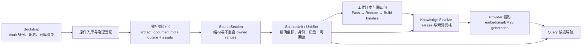

# SourceUnit 设计与作用：从文件入库到知识构建、检索

日期：2026-09-23。本文解释当前 P5 SourceUnit 体系的设计理由、生成过程及消费边界，适用于 `main` 与 `intranet` 的共享实现。它是可独立阅读的架构说明；字段和命令的精确定义仍以 [ADR-0003](architecture/0003-source-unit-contracts.md)、[ADR-0005](architecture/0005-shared-chunk-engine.md)、[共享包规范](../hermes-source-units/README.md)和 [Controlled Ingest 操作合同](../hermes-obsidian-controlled-ingest/references/source-units.md)为准。

## 1. 一句话理解

**SourceUnit 是从一个已登记、可校验版本的规范化来源中生成的、具有稳定身份和精确原文定位的内容单元。** 它可以是规范正文的一段连续字符范围，也可以是一个有明确类型和指纹的来源资产。知识构建用它决定“读了哪段、哪些事实由哪段支持”；检索 Provider 用它生成可重建的索引输入；查询命中后仍按同一个 UnitRef 回到 Vault 核对来源。

SourceUnit 位于来源准备与下游消费之间。Bootstrap 建立配置和仓库骨架；摄取的前半段保存原件、确定文档/版本身份并产出规范化 artifact；SourceUnit 把这些产物变成可引用、可复核的共同输入。它本身不表示模型已读过、知识页已写成、业务版本已批准或向量索引已就绪。



图中 `U → Q` 表示查询按 UnitRef 精确回读来源；Provider 返回的 snippet 和分数只是候选导航。`U → L` 表示 release 还会判定来源单元本身的索引资格。知识构建无需先建立向量索引，Provider 也不能仅因某个 UnitSet 存在就把它纳入检索。

## 2. 为什么需要这一层

早期系统已经能把工程 PDF 转成 Bundle：`document.md` 保存规范正文，`outline.json` 保存章节、页码和资产；`source-map.md` 给人看来源与处理进度，`section-ledger.json` 给程序记录章节领取、状态、输出、QA 和断点恢复。这些机制解决了“材料在哪里、谁处理了哪些章节”的问题，但章节责任范围不是一个同时供知识构建和检索引用的独立内容身份。旧 Provider 还会从 Markdown 自行切块，形成另一套 chunk ID 和粗略定位；知识页与检索命中难以保证指向同一个原文核心。

SourceUnit 的关键调整是：**先由来源内容层建立结构和可引用单元，再让工作账本与 Provider 消费它。** 工作状态不决定正文切在哪里；索引切片也不决定来源身份。旧 Vault 的 ledger、source map、Provider chunk 和页面引用不导入新体系；新库从原件重新 bootstrap/ingest。旧流程在尚未切换能力声明的 Vault 中有自己的兼容合同，不能与新 UnitRef 混写。

| 早期概念 | 保留下来的能力 | 当前职责归属 |
| --- | --- | --- |
| Bundle outline | 章节层级、页码、图表资产、质量线索 | 规范化 artifact 的 `outline.json`；Chunk Engine 由此构造 SourceSection |
| Section ledger 的 `content_ranges` | 父章节扣除子章节，避免重复处理同一正文 | 来源内容层计算非重叠 `owned_ranges`；工作账本只引用结果并记录处理状态 |
| Section ledger 的状态与 revision | 领取、恢复、冲突、QA、输出审计 | 仍属工作控制面；新 Unit work / batch / workflow ledger 不拥有正文边界 |
| Source map | 面向人的章节、来源与进度导航 | 旧 Bundle 链路仍可从 ledger 生成；P5 UnitSet 不以它为权威，也不要求先创建旧 source map |
| 旧 Provider chunk | 为召回生成短文本及向量/BM25 输入 | release 许可后从 SourceUnit 生成可重建投影；不再独立定义普通来源切块 |

这里的“吸收”是复用有用的结构与治理原则，而不是把旧 ledger JSON 或 source-map Markdown 直接改名为 SourceUnit。一个 SourceSection 表示文档结构和完整 `scope`，一个或多个 `owned_ranges` 表示该节真正拥有的正文。SourceUnit 在这些自有范围内切出较小的核心，另带精确定位、版本、内容哈希、资产和质量关系。工作状态、阅读窗口、知识页与索引代次继续作为不同对象存在。

### 与 WeKnora chunk 思路的关系

项目在 2026-09 的设计研究中借鉴了 WeKnora 的几个方向：解析之后用确定性的结构优先/启发式/递归策略切块；在应用内容层保存可复用的块，而不是只在向量库留下临时文本；标题面包屑与正文核心分离；较大的章节或父上下文可辅助理解，较小块用于定位和检索。WeKnora 官方的[分块机制说明](https://github.com/Tencent/WeKnora/blob/main/docs/CHUNKING.md)和[文档处理流水线](https://github.com/Tencent/WeKnora/blob/main/website-docs/02-architecture/03-document-pipeline.md)解释了这些思路。链接指向上游当前文档；本段说的是本项目采纳的设计原则，不以 WeKnora 的运行参数或数据库结构作为本项目合同。

我们的实现作了自己的选择：UnitRef 由来源身份、artifact revision、UnitSet 和 locator/内容指纹确定；章节父子关系不复制成第二套“父块正文”；`context` 在读取时组合祖先和相邻内容，且不计入 SourceUnit 核心哈希。受保护的长表格、公式或代码块完整保留并报告 oversized，不为了满足预算静默截断。Provider 普通情况下一个 SourceUnit 对应一个索引文档，只有已报告的超大受保护结构才允许带精确原文坐标的例外 subspan。我们使用文件式 Vault 权威仓库，不要求采用 WeKnora 的数据库和调度器。

## 3. SourceUnit 周围有哪些对象

| 对象 | 回答的问题 | 能否被下游重新定义 |
| --- | --- | --- |
| Raw Source / Resource | 原件是什么、从哪里来、属于哪个业务文档与版本 | 否；保留原件和治理身份 |
| NormalizedArtifact | 这一版可处理的正文、outline、资产及其指纹是什么 | 否；规范化产物按 revision 保存 |
| SourceSection | 哪些范围属于哪个章节；完整 scope 与自有范围分别是什么 | 否；切分引擎以此为边界 |
| SourceUnit / UnitSet | 可引用的来源核心、精确坐标、质量和当前切分代次是什么 | 否；知识构建和 Provider 共用 |
| ReadingWindow / WorkLedger | 本次任务需要读什么、实际检查了什么、进展和输出如何 | 可以按任务建立，但不得改写来源核心 |
| Retrieval Projection | 为某个模型、renderer 和 release 准备什么索引输入 | 可以重建；不能成为新的来源身份 |
| Knowledge Page / Release | 哪些内容得到支持、可见、可发布和可检索 | 由构建与 Finalize 显式判定 |

一个文本 Unit 的完整 `unit_ref` 包含 `vault_id`、`resource_id`、`artifact_revision`、`unit_set_id`、`unit_id`。文档/业务版本身份保存在 Unit 记录及 artifact manifest 中。`locator.span` 使用规范正文的 Unicode code point、0-based 半开区间 `[start, end)`；它是原文绝对坐标，不是 PDF 页码。行号和已知页码另供展示。资产 Unit 使用 `whole-asset` 精度，不能凭空填写图像 bbox、表格单元格或字符 span。`content_type` 区分规范来源、来源资产及有明确派生关系的其他文本类型；模型描述不能无标记地冒充原始证据。

例如：父章节覆盖第 1–100 行，子章节覆盖第 40–70 行。来源层让父章节只拥有 1–39 与 71–100 行，子章节拥有 40–70 行。每个自有范围再产生一个或多个 Unit。相邻 Unit 可以在同一自有范围内有有限 overlap，覆盖率按区间并集计算；不能把重叠字数重复算成“读了更多原文”，也不能让 overlap 跨越子章节所有权边界。

## 4. 一个 SourceUnit 如何产生

### 4.1 Bootstrap：准备条件，不生成单元

新 Vault 的 Bootstrap 创建 `_system/sources/artifacts/`、`_system/sources/units/` 等目录、Vault 身份、治理注册表、共享配置和能力声明。`source.chunking` 指定 canonical 策略与预算；`reading` 和 `retrieval` 预算分别服务知识阅读与索引渲染。Bootstrap 尚未收到具体原件，因此不创建 SourceUnit，也不会把空目录视为完成摄取。

### 4.2 前半段 ingest：原件到不可变 artifact

Controlled Ingest 保存和登记原件，校验来源机构、document/version/resource 关系。工程 PDF 经 MinerU 与 Bundle v2 得到 `document.md`、`outline.json`、页码、表格/图片资产和 QA；已登记的 UTF-8 Markdown 可走直接适配。`prepare-bundle` 要求 Bundle 已经通过治理 `ingest-finish` 写入身份；`prepare-markdown` 需要明确的 document、version、resource ID。准备步骤只产出不可变 NormalizedArtifact，不发布 UnitSet。

适配器只把 CRLF/CR 统一为 LF，按 Unicode code point 定义坐标，不暗中 trim 或改变 Unicode 组合形式。artifact 保存规范正文、outline、资产和 manifest；它用原件、规范正文、outline 与资产的指纹计算 `artifact_revision`。读取前会重验文件哈希、Vault 身份、路径和治理状态。解析方式或原件改变会产生新的 artifact revision；模型或 embedding 改变不会。

### 4.3 Chunk Engine：先定责任范围，再切内容核心

`preview` 与 `build` 调用相同的 [SharedChunkEngine](../hermes-source-units/src/hermes_source_units/chunk_engine/engine.py)。引擎先分析文档结构。`auto` 对可靠 outline 先试结构策略，再试启发式，最后递归回退；没有可靠 outline 时从启发式开始。显式策略也有可审计回退链。每次尝试和拒绝理由写入引擎报告。

第一步根据 Bundle outline、Markdown 标题、启发式边界或 root fallback 构造 SourceSection。每节保存完整 `scope`；把直接子节的 scope 从父节扣除，得到不重叠的 `owned_ranges`，并验证所有自有范围恰好覆盖规范正文。第二步只在每个自有范围内识别原子结构、按分隔符和预算切分普通长段、合并相邻短段并施加有限 overlap。代码围栏、块公式、Markdown 表格、连续列表等受保护结构不能被普通策略任意截断。候选必须通过覆盖、越界、异常碎片、大小、结构和 overlap 检查；失败则回退并记录诊断。

当前随包默认值是 target 512、max 1024、overlap 80 个 code points；它们是可配置起始值，不是 embedding 模型的 token 上限。`token_budget` 可为 `off/audit/hard`；没有真实 `TokenCounter` 时不得声称完成 token 审计。某个不可安全拆开的结构超限时标记 `oversized-protected-structure` 并保留原文，后续索引再按真实 tokenizer 处理或阻断。

### 4.4 生成身份、发布与校验

切分结果最初只是 section ID 与原文绝对 span。`FileSourceUnitService` 结合 artifact 和有效配置生成确定性身份：

```text
artifact_revision = fingerprint(原件/规范正文/outline/资产组成的 artifact payload)
unit_set_id       = fingerprint(artifact_revision + engine_version
                                + engine_fingerprint + source.chunking 配置指纹)
unit_id           = fingerprint(来源身份 + unit_set_id + locator + content_sha256)
```

文本 Unit 保存 `section_id`、`heading_path`、原文 span、行/页、内容哈希、关联资产和质量引用；资产 Unit 保存原资产路径、媒体类型、页码、SHA-256 和 `whole-asset` 定位。标题、祖先上下文与索引前缀不进入文本核心的 `content_sha256`。`prev_ref` / `next_ref` 提供相邻导航，不能取代章节结构。

`preview` 只计算预期 manifest、sections、units 和诊断；`build` 在完整验证及 `expected_revision` 冲突检查后，把不可变的 `manifest.json`、`sections.json`、`units.jsonl`、`engine.json` 发布到 `_system/sources/units/<resource>/<unit-set>/`，再原子更新该 resource 的 `current.json`。同输入重复构建是幂等的；旧 UnitSet 不能悄悄重新成为当前版本。`engine.json` 保存有效配置、策略尝试、token 审计、覆盖率和 oversized 诊断。之后 `validate` 重验 artifact、UnitSet 身份、文件哈希与覆盖；`get` / `context` 按治理 revision 和 UnitRef 回读真实内容。

操作入口见 [SourceUnit 指令](../hermes-obsidian-controlled-ingest/references/source-units.md)。发布前的 Bundle、治理和 QA 门禁仍要由相应 Ingest 流程完成；不能把 `build` 命令当成原件登记或专业复核的替代品。

### 4.5 用一份工程 PDF 串起这些记录

以下是目录关系示意，不代表已经处理过某份真实材料：

```text
10_Raw/manual.pdf
  → 10_Raw/converted/manual_bundle/{manifest.json, document.md, outline.json, tables/, images/}
  → _system/sources/artifacts/<resource-id>/<artifact-revision>/{manifest.json, document.md, outline.json, ...}
  → _system/sources/units/<resource-id>/<unit-set-id>/{manifest.json, sections.json, units.jsonl, engine.json}
  → _system/sources/units/<resource-id>/current.json
```

假设 `outline.json` 把“安全要求”识别为一节，它的自有正文中有普通段落和一张完整表格。Chunk Engine 先给该节划出自有范围，再把普通段落按配置切成若干文本 Unit；表格若是正文中的受保护结构，应完整保留或报告 oversized；另存的表格资产还可形成独立 `source_asset` Unit。每个文本 Unit 的 locator 指向 artifact `document.md` 的精确字符范围；表格资产 Unit 指向其受控文件与哈希。`engine.json` 能说明为什么采用某种策略、是否回退和有没有超限。后续任务通过 UnitRef 读取这些内容，而不是重新从 PDF 页码猜测或从 source-map 文本复制片段。

## 5. 启下：两条消费路径

### 5.1 知识摄取如何消费

知识任务以 UnitRefs 指定目标。Reader 为每次任务持久化有界 reading package，分清核心、祖先/相邻上下文和资产；上下文帮助理解，但只展示上下文不算已检查目标。批量路径先测量实际序列化的 `window + materials`，按精确阅读预算计划；准备时用同一算法复核，输入漂移就停止。Pass 记录实际检查的支持范围、候选和引用；后续 resource/global Reduce 处理跨任务、跨来源的候选与稳定页面身份；Build Finalize 校验 review、证据、QA 和页面修订。

工作账本记录任务领取、状态、覆盖、重试、人工检查点和输出，却不另切原文。不同任务可以有意识地读取同一 Unit；一个 Unit 也可以支持多个知识结论。反过来，一个事实可能需要多个 Unit 共同支持。SourceUnit 是证据载体，不是 Claim、概念实体或已批准知识页。没有完成任务、复核及 Finalize，不能把“已有 Unit”报告为“已有可用知识”。

### 5.2 向量/BM25 chunk 如何消费

Knowledge Finalize 从已完成 builds 和来源变更发布不可变 release，明确哪些 SourceUnit/知识页有索引资格。只有 release 已提交，显式的 `sync_release_index.py` 才能让 qmd-like-rag 读取许可语料。Provider 校验当前 release、UnitSet 和来源读取资格；普通来源 Unit 渲染为一个索引文档，附加标题面包屑但保留原 UnitRef。模型/tokenizer、renderer 和 generation 有独立指纹，Chroma/BM25 等可重建数据存放在 Provider 主机，不回写为 Vault 的新来源单元。

真实 tokenizer 会检查“标题 + 核心”的索引输入。普通超限必须阻断；只有来源层已报告的超大受保护结构，才可生成带精确原文 `subspan` 的例外投影。改变 embedding 模型或索引 renderer 需要新投影/generation，但不改变原 SourceUnit 身份。Query 接受 Provider 候选后核对当前 release、资格与 UnitRef，再回读 SourceUnit 核心或明确 subspan；snippet、标题前缀和相似度分数都不能直接当作答复证据。Provider 不可用时，Query 仍可按配置使用分层/传统定位，而不会在查询中建索引。

## 6. 变更、限制与当前状态

| 发生的变化 | 应改变的对象 | 不应偷换的对象 |
| --- | --- | --- |
| 原件、解析结果、outline 或资产变化 | 新 artifact revision；重建并验证 UnitSet、工作依赖 | 旧引用不自动指向“看起来相似”的新版 |
| `source.chunking` 的策略、大小、overlap 变化 | 新 UnitSet 与可能变化的 Unit ID | 不把旧任务/页面证据静默认作新单元 |
| 工作任务或阅读预算变化 | 新/修订的 task、reading package、Pass 及工作流记录 | 不改变已经发布的来源核心身份 |
| 模型、tokenizer 或 renderer 变化 | Provider 投影与 generation 指纹、索引状态 | 不重新定义 artifact、SourceUnit 或业务版本 |
| 业务版次审批、QA 或来源撤回 | 治理状态、知识贡献资格、release 与查询可见性 | 不篡改已发布 artifact/UnitSet 文件 |

截至 2026-09-23，共享 Chunk Engine、SourceUnit 发布/读取、知识构建、release 驱动的 Provider 0.5 代码及 main WSL 运行时已经具备；尚无真实 P5 release generation，正式新库端到端重建和 intranet 联调未验收。持久化摄取编排已实现，但主机自主 worker 派发默认关闭。具体当前门禁见[演进计划](SOURCE_UNITS_EVOLUTION_PLAN.md)和[官方技术规范](OFFICIAL_TECHNICAL_SPECIFICATION.md)。
